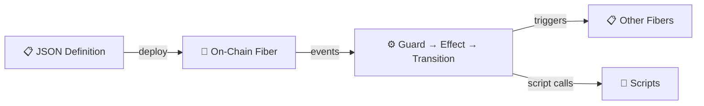

# OttoChain

A metagraph on [Constellation Network](https://constellationnetwork.io/) for creating automated workflow contracts using JSON-encoded state machines and scripts.

**[📖 Read the Introduction →](docs/introduction.md)**

## What is OttoChain?

OttoChain turns JSON into executable workflows on a distributed ledger. Define state machines with guards, effects, and transitions — all in JSON Logic — and deploy them without writing application code.

### Key Capabilities

- **JSON-Encoded State Machines** — Define workflows as states, transitions, guards, and effects in JSON
- **Scripts** — Stateful computation units callable by state machines
- **Cross-Machine Triggers** — One machine's transition fires events on other machines
- **Parent-Child Spawning** — Dynamically create child machines at runtime
- **Broadcast Triggers** — Fan out events to many machines simultaneously
- **Gas Metering** — Bounded computation with cycle detection
- **AI-Friendly** — LLMs read, write, and reason about JSON Logic natively

## Examples

| Example | Machines | What It Demonstrates |
|---------|----------|---------------------|
| [Tic-Tac-Toe](docs/examples/tictactoe.md) | 1 + script | Script-centric architecture pattern |
| [Fuel Logistics](docs/examples/fuel-logistics.md) | 4 | Cross-machine triggers, GPS tracking |
| [Clinical Trial](docs/examples/clinical-trial.md) | 6 | Multiple guards, bi-directional transitions |
| [Real Estate](docs/examples/real-estate.md) | 8 | Self-transitions, lifecycle management |
| [Riverdale Economy](docs/examples/riverdale-economy.md) | 17 instances | Broadcast triggers, parent-child spawning, full ecosystem |

## Quick Links

- 📖 [Introduction](docs/introduction.md) — What OttoChain is and how it works
- 📚 [Documentation Hub](docs/README.md) — All documentation
- 💡 [Examples](docs/examples/README.md) — Real-world state machine examples
- 🏗️ [State Machine Design Guide](docs/guides/state-machine-design.md) — How to write state machines
- 🚀 [Deployment Guide](docs/guides/deployment.md) — Deploy your metagraph
- 🧪 [Testing Terminal](docs/guides/terminal-usage.md) — Interactive CLI for testing

## Architecture

OttoChain runs three layers on each node, built on Constellation's Tessellation framework:

| Layer | Port | Purpose |
|-------|------|---------|
| Data L1 | 9300 | Fiber processing — events, script calls, validation |
| Currency L1 | 9200 | Token transfers and balances |
| Metagraph L0 | 9100 | Consensus, snapshots, state management |

See [Architecture Details](docs/reference/architecture.md) for the full technical breakdown.

## Tech Stack

- **Scala 2.13** with cats-effect, fs2, circe
- **Tessellation** metagraph SDK
- **JSON Logic** with OttoChain extensions (_scriptCall, _trigger, _spawn, _emit)
- **sbt** multi-module build

## License

Apache License 2.0
