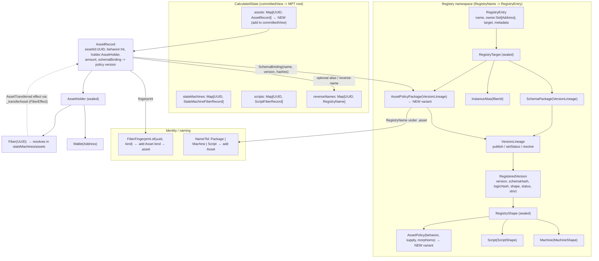

# OttoChain Asset Model — Architecture Review, Cross-Network Research & Interop Formalism

**Status:** review / design. **Date:** 2026-06-15.

This report reviews the asset-model RFC at `docs/proposals/asset-model.md`.

## Executive summary

The asset model is **design-only**: the RFC at `docs/proposals/asset-model.md` predates the merged registry, no Scala exists yet, and several "changes to existing files" cite type shapes (`stateMessage: String`, `RegistryEntry.versions`, `NameRecord`/`NameTarget`) that no longer match the source. The RFC is roughly closed on one axis — the asset *algebra* (5-bit `TokenBehavior`, the `meet()` lattice, typed morphisms, supply derived from records) is self-consistent and testable — but only sketched on the other: *inhabitation*, i.e. how assets and policies live inside the registry/fiber/naming machinery the chain already has. Because it is design-only, the cost of fixing everything below is near-zero today and becomes a breaking on-chain-state-plus-signed-message migration if it ships as drafted.

The strongest ideas are genuine and externally validated. Ledger-native conservation (Cardano), a unified interface over fungible/NFT/multi-asset (Tezos FA2, Aptos FA), composable behavior flags on one asset (Token-2022), and the fiber-as-asset-holder custody primitive are all proven precedents that endorse the RFC's core bets — and the typed-morphism layer with codomain laws plus versionable fibers is net-new value none of those systems have. The single highest-leverage architectural move is to stop modeling `AssetPolicy` as a free-standing UUID record and make it a `RegistryTarget` variant over `VersionLineage`, so policies inherit versioning, ownership, governance, naming, fingerprints, conformance typing, and committed-state provability for free (and answer open-Q2 — custom morphisms become a new policy version).

The most important **formalism correction**: the `meet()` operation is a genuine greatest-lower-bound, but only on the product lattice `(𝔹,≤)³ × (𝔹,≥)²` — the E/G factors are **order-reversed**, which the RFC never states. This makes "a basket containing a soulbound token IS soulbound" **false** (Soulbound=0 is an interior point, not the bottom; bottom is `EG=3`, top is `TSC=28`), and the corrected statement is a security-relevant invariant: composing forces T/S/C off but can *acquire* E/G. The "monoidal category" framing is overclaimed — what holds is a commutative aggregation monoid plus a strict behavior homomorphism, with `Decompose∘Compose` a retraction (not a tensor inverse) and the morphisms a partial typed graph (no identities).

The **headline security concern** is that "`_transferAsset` effects only accepted from fiber transition results" gives no authorization guarantee and the §10 authorization diagram assumes a return channel that does not exist: `TransactionResult.Committed` has no asset field, so a naive implementation drops the effect silently (assets never move), and the effect extractor scrapes reserved keys verbatim with no `holder == this fiber` check (any deployable fiber could drain assets it does not hold). Both must be fixed in the combiner and the engine/combiner boundary, never in `validateSignedUpdate` (CLAUDE.md rule #3 — stateful asset/policy/nonce lineage reads there are TOCTOU block-poisoning). Finally, the **interop-functor thesis**: the OttoChain model is a target category rich enough to receive a structure-preserving map `F : Ext → Otto` from every external standard family — `F` is lax, partial, and forgetful (faithful on the structural skeleton, forgetful on quantitative decoration), every external standard is a sub-structure or quotient of Otto, and round-trip wrap/unwrap is a retraction (left-adjoint only on the structural quotient, not a clean adjunction). The load-bearing addition that makes interop real is `Option[OriginProvenance]` plus a deterministic canonical `policyId` derived from origin — the structural cure for the wrapped-asset fragmentation pathology.

## Prioritized recommendations

| ID | Priority | Area | Recommendation |
|---|---|---|---|
| R1 | P0 | Security / effect system | Enforce holder-ownership of `_transferAsset` in the `AssetCombiner`, never trust the effect: resolve `assetId` against `current.calculated.assets`, require `holder == AssetHolder.Fiber(sourceFiberId)`, `behavior.transferable`, and sufficient amount, else `CombineRejected`. Single highest-risk item — the extractor gives zero authorization. |
| R2 | P0 | Effect system / wiring | Add the asset return channel end-to-end: `FiberEffect.AssetTransferred` → `EffectExtractor.extractAssetTransfers` (new `GasExhaustionPhase.Morphism`) → `FiberResult.Success.assetTransfers` → through `buildSuccessOutcome`/`processStateMachineSuccess`/`completeStateMachineTransaction`/`dispatchTriggers` → `TransactionResult.Committed` → `withAssets` in the combiner. Without it the effect is silently dropped and assets never move. |
| R3 | P0 | Validation / TOCTOU (rule #3) | Keep ALL asset lineage/policy/nonce/supply checks combiner-only as graceful `CombineRejected`; `validateSignedUpdate` does structural checks only (field presence, expression depth, O(1) `AssetCommit` flag), mirroring the registry L1-structural dispatch in `Validator.scala`. Reading asset/policy/nonce lineage in block acceptance is block-poisoning. |
| R4 | P0 | Conceptual model | Make `AssetPolicy` a `RegistryTarget` variant over `VersionLineage` (`AssetPolicyPackage` + `RegistryShape.AssetPolicy(behavior, supply, morphisms)`); reuse `publish`/`setStatus`/`resolve`/`RegistryEntry.owner` verbatim; delete the free-standing `CalculatedState.assetPolicies` UUID map. Answers open-Q2 (custom morphisms = a new policy version). |
| R5 | P0 | Conceptual model | Pick one home for asset instances: an `AssetRecord` in its own `CalculatedState.assets` map pinning a `SchemaBinding` to its policy version; drop the contradictory `extends FiberRecord` + parallel-map design. |
| R6 | P0 | Committed state | Add TOTAL `CommitKey` projections to `committedView.entries` for `asset/<uuid>`, `asset-policy/<name>`, and `nonce/<uuid>` (with `StateProofHandler` `asset`/`assetPolicy` methods). A non-total key throws in combine = consensus halt; omission = tokens off-root and unprovable to light clients. |
| R7 | P0 | Committed state / DoS | Bound `usedNonces` growth: prune entries past `expiresAt` during combine (or key by a bounded window). Monotonic unbounded nonces bloat the committed MPT root and proof size. |
| R8 | P0 | Identity / naming | Specify identity against the real stack: policy identity = `RegistryName` under a new `NameTld.Asset`; instance identity = UUID + proquint fingerprint via a new `Asset` kind in `FiberFingerprint.of`. Guarantee "Never a bare UUID" for audit trails; decide alias granularity (per-policy yes, per-instance probably no). |
| R9 | P0 | Interop / provenance | Add `Option[OriginProvenance] = {originChainId, originAssetRef, fullPath, attestationHash}` to `AssetRecord`/`AssetPolicy` and an origin discriminator to `AssetCommit`; enforce as an `AssetCombiner` uniqueness invariant that `policyId = derive(originChainId, originAssetRef)` so the same foreign asset resolves to exactly one policy. Structural cure for the "10+ wrapped USDCs" fragmentation; field MUST be `Option` (invariant #1). |
| R10 | P0 | Formalism | State the order relation `a ≤ b ⟺ (T,S,C ≤) ∧ (E,G ≥)` and prove `meet` is the glb on `(𝔹,≤)³ × (𝔹,≥)²`. One definition + one theorem, code unchanged; drives corrected `AssetMorphismLawSuite` assertions. |
| R11 | P0 | Formalism / security | Fix the false "soulbound dominance" claim: composing with soulbound forces T/S/C off but may ACQUIRE E/G; bottom = `EG=3`, top = `TSC=28`, Soulbound=0 is interior. Surface this E/G behavior-acquisition hazard in interop tooling and assert the homomorphism `behavior(Compose(xs)) = foldMeet(...)`, never the folk-claim. |
| R12 | P0 | Formalism / design decision | Decide and document the E/G semantics explicitly: keep OR (non-cube lattice, the corrected caveat) or switch to AND (plain `𝔹⁵` cube, Soulbound=0 becomes true bottom). Justify the choice rather than leaving it implicit in a bit-table. |
| R13 | P0 | Conservation | Add an amount-conservation invariant to the `AssetCombiner` (`Σ inputs = Σ outputs ± policy-path mint/burn`) with a property test in `AssetMorphismLawSuite`. OttoChain has no linear types; this re-implements Move's free guarantee. Highest-value single addition. |
| R14 | P0 | Formalism / interop honesty | Document `F` as lax/partial/forgetful and the round-trip as a retraction (left-adjoint only on the structural quotient `Otto/≅_decoration`), not `wrap∘unwrap = id` two-sidedly and not a clean adjunction. Prevents chasing a literal inverse/tensor/Galois connection in Scala. |
| R15 | P1 | State typing | Type asset state through `SchemaShape`/`ConformanceChecker`: give `AssetRecord.stateData` a `MessageShape` on the `RegistryShape.AssetPolicy` projection so the strict-conformance gate validates produced state on mint and every morphism. |
| R16 | P1 | RFC hygiene | Re-baseline RFC §7 against the merged registry before any code: `RegistryEntry(name, owner, target, metadata)`, `RegisteredVersion(version, schemaHash, logicHash, shape, status, strict)`, `RegistryShape (Machine|Script→+AssetPolicy)`, `MachineShape` not `stateMessage: String`; drop `NameRecord`/`NameTarget`/`RegistryEntry.versions`; add an `OttochainMessage` dispatch entry. |
| R17 | P1 | Delegation | Generalize the one-time `usedNonces`/`AuthorizeCompose` mechanism (the EIP-2612-`permit` shape) into the universal delegation primitive for ANY delegated morphism. Prefer tight `allowedPolicies`/`allowedTypes` allowlists + one-time linear nonces over standing unlimited operator/allowance approval. |
| R18 | P1 | Nonce determinism | Pin nonce semantics: ordinal-based `expiresAt: SnapshotOrdinal` (no wall-clock); unpredictable nonces (commitment includes `lastSnapshotHash`); atomic read-then-mark of `usedNonces` within one `insert`; defined inclusive/exclusive `expiresAt` comparison against `FiberContext.ordinal`; deterministic pruning. |
| R19 | P1 | Custody / interop | Model lock-mint custody as a fiber-as-asset-holder state machine (`HOLDING → RELEASED`, upgradeable via `UpgradeFiber`); put the cross-chain attestation/verifier-set check in `mintPolicy` as a combiner-only guard. Inbound bridge = `Wrap` → `MintAsset` under `wrapped-{origin}`; require `Unwrap(Wrap(x)) = x` (the retraction law). |
| R20 | P1 | Effect system | Enforce `_transferAsset` single-pass / non-reentrant per combiner pass (the Aptos AIP-73 reentrancy lesson); the in-VM JLVM guard avoids the SPL/Aptos CPI reentrancy class by construction. |
| R21 | P1 | Execution limits | Cap asset mutations per transaction independent of `maxDepth` (`ExecutionLimits.maxAssetMutations`); document that reentrancy through asset-holding fibers is depth-bounded, not cycle-free (`processedInputs` keys on `(fiberId, eventName)`). |
| R22 | P1 | L1 fast-path correctness | The combiner must re-derive `behavior` from the authoritative `AssetRecord`, never from `OnChain.AssetCommit.behavior` (stale via the `<=` batching comparison). Verify `meet()`/codomain against the recomputed value. |
| R23 | P1 | Context provider / perf | Inject `heldAssets` into BOTH `ContextProvider` builders, sourced from `CalculatedState.assets` via a holder-keyed index to avoid the O(all-assets)-per-evaluation gas/perf cliff. |
| R24 | P1 | Decimals / interop | Add `decimals: Int` to `AssetPolicy` (S=1 fungibles; NFTs = 0) plus a decimal-normalization rule that travels with provenance (OFT `sharedDecimals`/dust, CCIP/Wormhole precedent) — else amounts silently corrupt across heterogeneous-precision ledgers. |
| R25 | P1 | Regulated assets | Add an agent/controller role (clawback/freeze/forced-transfer/recovery) as `Governed` Transfer/Burn morphisms with agent-role guards — combiner-only `CombineRejected` (rule #3). Required for ERC-3643/ASA/ERC-1400-class real-world securities; ASA Reserve maps onto derived circulating supply (ARC-62). |
| R26 | P1 | Formalism relabeling | Drop "monoidal category"; call it a commutative aggregation monoid + strict behavior homomorphism. Rename §4 "Unit law" → "Round-trip (retraction) law"; do NOT assert `Compose∘Decompose = id`. Characterize morphisms as a typed *partial* graph, not a `Category` trait (Cell/god-object trap). |
| R27 | P1 | Law suite | Tighten `AssetMorphismLawSuite` to the corrected laws over all 32 behaviors: `meet` idempotent/commutative/associative + `meet(a,b) ≤ a,b`; behavior homomorphism incl. the empty/unit case; `Decompose∘Compose = id` (retraction only); conservation; typed-chain rejection at first domain-guard failure; the no-reentrant-`_transferAsset` invariant. |
| R28 | P1 | Validation boundary | State the CLAUDE.md #3 boundary explicitly for policy-as-package: L1 reads only `AssetCommit.behavior` (safe `OnChain` int); morphism policy/visibility allowlists read `registry` lineage and MUST remain combiner-only. |
| R29 | P1 | Supply policy | Make mint/burn authority immutable after `CreateAssetPolicy` (or only monotonically removable; Disabled = one-way close); adopt Runes-style declarative `mintPolicy` (premine + cap×amount + windows) as the canonical shape; keep `totalMinted` a derived cache, not a hot mutable counter (avoids the Aptos parallel-mint contention pitfall). |
| R30 | P2 | Multi-token model | Address the singleton-multi-token gap (ERC-1155/6909, FA2 `token_id`, Token-2022 Group, SPL collections): model as a registry namespace grouping related `AssetPolicy` UUIDs (or optional `collectionId`/`groupId`); the one place the external survey is more expressive than the current model. |
| R31 | P2 | Custom morphisms | Implement open-Q2 as a `RegisteredVersion` under a new `.morphism` TLD: `schemaHash` pins the typed signature (domain bits + codomain `SchemaShape`), `logicHash` pins codomain/guard logic; structural signature checkable at L1, version-lineage resolution combiner-only. No protocol upgrade per new morphism. |
| R32 | P2 | Formalism | Define the empty-composite / unit object explicitly (behavior = lattice top = Fungible 28) so the behavior homomorphism is testable on the empty case and the aggregation monoid has a neutral element. Name Burn's terminal/zero codomain if the law suite needs it; specify whether unstake restores exact pre-stake behavior. |
| R33 | P2 | Signing canonical | Add `AssetOp` cases (`CreateAssetPolicy`/`MintAsset`/`ApplyMorphism`/`AuthorizeCompose`) to `PublishVersionSigningCanonicalSuite` to guard against the `Boolean=false`/empty-map default trap (invariant #1); every new signed field is `Option[T]` or required-no-default. |
| R34 | P2 | Upgrade safety | Add an upgrade invariant (`AssetMorphismLawSuite`): `UpgradeFiber` on an asset-holder preserves held `AssetRecord`s, and the migration expression cannot fabricate `_transferAsset` of held assets during the migration pass. |
| R35 | P2 | Capability model | Evaluate a non-fungible `AssetRecord` acting as a transferable, discoverable mint-capability (Sui `TreasuryCap`/Aptos `MintRef` analogue) to gain Move's transferable mint authority that pure JSON-Logic guards lack. |
| R36 | P2 | Strict vs lax tagging | Tag each interop adapter strict-`φ` (ledger-conserved bundles: Cardano `Value`, Sui DOF, Charms strings) vs lax-`φ` (uncodified-custody bundles: EVM WETH/4626/baskets) so integrators know which imports preserve `Decompose∘Compose = id` end-to-end. |
| R37 | P2 | Derived display | Express royalties (EIP-2981 informational, non-enforcing field) and interest-bearing/rebasing as read-side derived `uiAmount`/`derivedAmount` JSON-Logic, not stored mint/burn (also structurally mitigates the ERC-4626 first-depositor inflation attack). |
| R38 | P2 | Component lock | Resolve the open component-lock and within-snapshot conflict questions before implementation: whether component `AssetRecord`s are frozen inside a composite, and whether that lock is structural (`AssetCommit` status flag) or combiner-only; and within-transaction double-move resolution under signature-tiebreak order. |
| R39 | P2 | Rejection surfacing | Wire asset `RejectionReceipt` to the indexer/webhook: combine-rejections land only in `OnChain.latestLogs` today, so an off-chain wallet transferring an asset it no longer holds won't see the rejection. |
| R40 | P2 | Open questions / DAG currency | Resolve open-Q3 (hard-reject structural asset violations at L1, consistent with sequence-number violations) and open-Q1 (metagraph-only currency first with a governed `burnPolicy` bridge); the merged committed-state migration already makes balances field-level provable, strengthening the metagraph-only position. Confidential/zk variants are a deliberate later phase (Token-2022's June-2025 ZK soundness failure validates readable-JLVM-first). |

## Contents

- [1. Cross-network landscape](#1-cross-network-landscape)
- [2. The unifying conceptual model: assets ⇄ machines / scripts / registry / naming](#2-the-unifying-conceptual-model-assets--machines--scripts--registry--naming)
- [3. The interop functor: a formal morphism between external and internal asset schemas](#3-the-interop-functor-a-formal-morphism-between-external-and-internal-asset-schemas)
- [4. Security and fiber-effect-system compatibility](#4-security-and-fiber-effect-system-compatibility)
- [5. Design critique and enrichment roadmap](#5-design-critique-and-enrichment-roadmap)

---

I have the terminology. The presets (NFT=16, Fungible=28, Soulbound=0), the 5-bit T/S/C/E/G model, typed morphisms (Wrap/Compose/Decompose/Fractionalize), AssetPolicy/AssetRecord, AssetCommit on OnChain, the L1 fast-path, and CLAUDE.md invariants are all consistent with the JSON. I have everything needed to write the section precisely.

Here is the section:

---

## 1. Cross-network landscape

Before specifying OttoChain's asset model, it is worth situating it against how the rest of the industry represents value on-chain. The design space sorts cleanly into four families, distinguished by *where the asset lives* and *who enforces its invariants*. The first is **contract-defined**: the chain has one native coin tracked at the protocol level (Ethereum's ETH), and every other token is an ordinary smart contract maintaining its own ledger in storage. There is no protocol notion of "a token" — fungibility, supply, conservation, and transfer semantics are all contract bytecode, and the ERC standards exist only as interface conventions (function selectors, events, ERC-165 interface IDs) so wallets and other contracts can interoperate against a known ABI. The trust model is therefore code-plus-audit-plus-admin-key: nothing prevents a buggy or malicious contract from minting arbitrarily, and `totalSupply()` is merely a counter the contract chooses to maintain. Solana's SPL/Token-2022 programs are a hybrid of this and the next family — a single stateless program owns caller-owned Mint and Token accounts, so behavior is a fixed catalog of program features rather than per-token bytecode.

The second family is **ledger-native**: assets are first-class entries the protocol itself tracks and conserves, with no per-token contract. Cardano carries a two-level `Value = Coin + Map PolicyID (Map AssetName Quantity)` inside every UTXO, so a transfer is just value-conserving UTXO spending — no per-token transfer function, no approve/allowance, no operator pattern exists for native assets. Algorand's ASA is the account-model counterpart: an asset is a protocol object with an immutable `Total`, a built-in four-role RBAC (Manager/Reserve/Freeze/Clawback), and ledger-enforced conservation. The Cosmos SDK `x/bank` module is a third variant — a single shared multi-asset balance store keyed by `(address, denom)` rather than a contract per token. The defining property of this family is that "no double-spend" and "supply is conserved" are *chain* guarantees, not code guarantees. The third family, **object/resource**, makes the asset a linear value the type system refuses to duplicate or silently drop: Move's resource abilities (no `copy`, no `drop`) make value-creation and double-spend structurally impossible at the language level, enforced by the bytecode verifier, with mint/burn authority carried as unforgeable capability objects (Sui `TreasuryCap`, Aptos `MintRef`/`BurnRef`/`TransferRef`). The fourth, **UTXO-bound metaprotocols**, layers a typed asset model over Bitcoin's UTXO set — Runes (on-chain OP_RETURN), Ordinals (sat-bound inscriptions), and the client-side-validated families RGB, Taproot Assets, and CHARMS, which keep state and proofs off-chain and commit only hashes to Bitcoin.

Cutting across all four is the **interoperability and provenance** dimension, which is where the models diverge most sharply and fail most often. EVM, Move, Solana, and the ledger-native chains have *no native cross-chain identity*: a foreign asset becomes a fresh local contract or denom whose backing lives entirely in a bridge's trust model. The result is the canonical fragmentation pathology — the "same" asset minted by N different bridges becomes N mutually non-fungible wrappers (10+ distinct wrapped-USDC representations on some chains), recombinable only by round-tripping the origin. The disciplined exceptions are instructive: IBC's `denom-trace` makes *identity the provenance itself* — the denom encodes the full ordered `{port}/{channel}` path, prefixes are prepended on forward hops and trimmed on return, so a round-trip is bit-identical with no trusted registry; Axelar ITS derives a single global `interchainTokenId = keccak256(deployer, salt)` that must exist on every chain; and the canonical burn-mint designs (CCTP, Wormhole NTT, LayerZero OFT, ITS-native) eliminate competing wrappers by maintaining one global identity and one mobile supply. These are the patterns OttoChain must study, because the RFC's `AssetRecord` currently carries no provenance field at all.

### Comparison

| Network family | Asset representation | Fungibility model | Supply / mint authority | Transfer & composition | Programmability | Security / conservation | Interop & provenance |
|---|---|---|---|---|---|---|---|
| **Ethereum / EVM** (incl. all EVM L2s) | Per-token smart contract holding its own ledger in storage; only native ETH is protocol-level. Identity = contract address (+tokenId). | Structural by ledger shape: scalar balance (ERC-20), per-id owner map (ERC-721), id→balance map (ERC-1155/6909). Partitions (ERC-1400) for partial fungibility. | No protocol supply; `totalSupply()` is a self-kept counter. Mint/burn are conventions (OZ `_mint`/`_burn`) gated by `onlyOwner`/roles/cap. ERC-3643 adds agent forced-transfer/recovery. | `transfer`/`transferFrom` + numeric allowance (ERC-20), per-token or operator approval (721/1155), hybrid (6909). EIP-2612 `permit` = gasless signed approval. Composition = ad-hoc custody contracts (WETH, ERC-4626 vaults). | Arbitrary Solidity; standards fix only the interface. Transfer hooks (`_update`), pluggable compliance (ERC-3643), royalties (EIP-2981, non-enforcing), upgradeable proxies (EIP-1967/UUPS). | Conservation = EVM atomicity + the contract's own accounting; no protocol safety net. Reentrancy, unlimited-approval phishing, ERC-4626 inflation attack, admin-key compromise. | No native cross-chain identity; foreign asset = bridge-minted wrapper, provenance only in bridge attestations. ERC-7281 standardizes per-bridge mint limits. |
| **Cardano (eUTXO)** | First-class ledger `Value` in every UTXO: `Coin + Map PolicyID (Map AssetName Quantity)`. AssetID = PolicyID (blake2b-224 of policy script) + AssetName. Not contract state. | Convention over quantity: fungible = qty > 1; NFT = supply 1 enforced by policy. Multi-asset is free (one PolicyID namespaces many AssetNames). No ledger type flag. | One immutable minting policy (native or Plutus); mint/burn via the tx `mint` field (positive/negative). No `maxSupply` field, no separate burn authority; supply derived net of burns. | No asset-specific logic — transfer is value-conserving UTXO spend. No approve/allowance/operator. Bundles compose for free; wrapping/vaults are app-level Plutus. | Native scripts (sig/time/threshold, no VM) or Plutus. CIP-68 reference-NFT + inline datum for updatable on-chain metadata. | Protocol-enforced conservation (inputs + mint = outputs + fee). UTXO double-spend prevention. Footguns: NFT re-mint bugs, token-dust spam (min-ada), single-UTXO contention. | No native wrapped/cross-chain primitive; foreign asset = native asset under a bridge's policy. No morphisms beyond mint/burn. |
| **Cosmos SDK / IBC** | Module-level `x/bank` balance map `(address, denom) → amount`; no contract per token. Denoms: native, `factory/...` (tokenfactory), `ibc/{hash}` vouchers. | Fungible by denom (scalar Int, account-model). NFTs need `x/nft`/cw721. **Cross-chain fungibility is path-bound** — same asset over different channels = different non-fungible denoms. | Module-permissioned mint/burn; tokenfactory democratizes per-denom (creator=admin, can renounce). IBC vouchers minted/burned only by the transfer module. `TotalEscrowForDenom` invariant. | `MsgSend`; `x/authz` grants (the approve/allowance analog, generic over msg types). ICS-20 escrow/mint; composition via middleware reading the opaque packet `memo` (PFM, IBC-hooks). | `x/bank` not programmable; behavior from CosmWasm, tokenfactory bindings, IBC middleware. Upgrades via governance + `x/upgrade`. | Supply = sum of balances; BFT + sequence-number replay protection. Cross-chain: 1:1 escrow-backs-voucher, verified by light clients; only as safe as the weakest connected chain. | **Provenance gold standard**: `denom-trace {path, base_denom}` self-describing; source/sink zone test decides escrow-vs-mint; round-trips restore the native denom. |
| **Bitcoin metaprotocols** (Runes / Ordinals / RGB / Taproot Assets / CHARMS) | Asset state bound to a UTXO. On-chain (Runes OP_RETURN, Ordinals sat-bound) vs client-side-validated off-chain commitments (RGB seals, Taproot Assets MS-SMT, CHARMS spell+zk-proof). | Runes fungible-only; Ordinals NFT-only; RGB interfaces (RGB20/21/25); Taproot Assets `asset_type` normal/collectible; CHARMS tag-discriminated (`t`=token / `n`=NFT / other=app), unified in one map. | Runes declarative etching (premine + cap×amount + windows), permissionless mint within terms. RGB/Taproot/CHARMS: authority = seal/cap/contract holder. | Runes "edicts" in the runestone; Ordinals = plain spend; RGB seal-close transition; Taproot Assets MS-SMT split/merge; CHARMS "string of charms" (first-class compose, contract sees whole tx). | Spectrum: Runes/Ordinals none < Taproot Assets fixed < RGB (AluVM) < CHARMS (full SP1 zkVM, `app_contract(app, tx, x, w)→bool`). | Bitcoin consensus prevents UTXO double-spend; metaprotocol adds asset-correctness. Indexer-trust (on-chain) vs data-availability risk (client-side). Conservation = MS-SUM tree / structural sum / indexer arithmetic. | Runes/Ordinals Bitcoin-locked. RGB contract-scoped lineage DAG. **CHARMS strongest**: recursive zk-proof "the proof is the bridge," charms beam across UTXO chains. |
| **Move — Sui** (object-centric) | On-chain objects with `UID`; `Coin<T>` wraps inner `Balance<T>`; `CoinMetadata<T>` separate, usually frozen. NFTs are user `key` objects. | Split/merge on `Coin<T>` (UTXO-like, value spread across discrete objects); NFTs are distinct objects; closed-loop `Token<T>` for restricted fungibles. | `TreasuryCap<T>` capability object (created via OTW-gated `create_currency`); mint/burn gated by possession. Regulated coins add `DenyCapV2` + `DenyList`. | `transfer`/`public_transfer`; **no allowance — possession is authority**. Composition via wrapping, dynamic (object) fields, Receiving. PTBs chain ≤1024 commands atomically. | Arbitrary Move; capability-gated functions; closed-loop `TokenPolicy` rules; package upgrade via `UpgradeCap`. No per-Coin transfer hook. | **Move resource linearity** (no copy/drop, bytecode-verified) makes duplication/loss impossible. Footguns: capability reuse, shared-object races. | Foreign asset = native `Coin<T>` with bridge-held `TreasuryCap`; provenance = unique type `T` (OTW-guaranteed). Stable `UID` across ownership changes. |
| **Move — Aptos** (resource/object) | Legacy `Coin<T>` in `CoinStore<T>` resource; modern **Fungible Asset**: `Metadata` object = identity, `FungibleStore` objects = balances (deterministic primary store). In-transit `FungibleAsset` is a hot-potato (no `store`). | FA fungible by shared `Metadata`; runtime-typed (metadata-as-value) → one function handles many FA types, but must validate `Metadata` (the #1 footgun). DA standard for NFTs. | `MintRef`/`BurnRef`/`TransferRef` generated only at creation from `ConstructorRef`, **not regenerable**. `Metadata` carries supply (+optional max; max disables parallel mint). | `fungible_asset::transfer` / `primary_fungible_store::transfer`; `transfer_with_ref` bypasses freeze. No allowance. Composition via transitive object ownership. No PTB. | **Dispatchable FA (AIP-73)**: `register_dispatch_functions` stores withdraw/deposit/derived_balance hooks in `Metadata`; hooks must use `*_with_ref` (reentrancy guard). | Resource linearity (as Sui); FA adds hot-potato. Footguns: metadata-validation gaps, transitive-ownership store bypass, dispatchable reentrancy. | **Coin↔FA canonical pairing** (`paired_metadata`, `coin_to_fungible_asset`): one economic asset, two faces, single canonical identity during migration. |
| **Solana (SVM)** | Account-model: a token = a Mint account; balances in Token Accounts (ATA PDA). Token-2022 appends coexisting extensions in a TLV region on the Mint. | Fungible by default (u64 + decimals); NFT = decimals 0/supply 1/authority revoked. No native multi-token. Token-2022 elevates typing: Non-Transferable, Group/Member. | Mutable `supply` u64 on the Mint (authoritative, not derived). Mint authority `Option<Pubkey>`; `SetAuthority`→None permanently revokes. Permanent Delegate = clawback; Default-Frozen = allowlist gate. | `TransferChecked` between same-mint accounts; single delegate via `Approve` (no operator-for-all). Transfer Fee withheld in **recipient** account. Composition external. | Fixed ~19-extension catalog toggled at mint-init (mostly immutable). **Transfer Hook** = the one escape hatch (CPI to external program, accounts read-only + `transferring` flag). | Program-owned accounts + serialized writes prevent double-spend. **June 2025 ZK ElGamal soundness bug** (Fiat-Shamir omission → forged proofs) disabled confidential transfers — novel-ZK liability. | No native cross-chain; foreign asset = new Mint under a bridge's authority; provenance in bridge + `MetadataPointer`. |
| **Tezos FA2 (TZIP-12)** | Contract-level: asset = `(contract, token_id)`; one Michelson contract holds a ledger big_map + token_metadata. Not protocol ledger. | **One unified interface** spans fungible / NFT / multi-asset, parameterized by `token_id` (supply/decimals), not separate types. | Mint/burn not mandated by TZIP-12 — implementation-defined, typically admin-gated. Supply tracking optional. | Batch `transfer` (multi-token, atomic — the headline win); `update_operators` grants *unlimited* per-(owner, token_id) authority (no numeric allowance). | Fully programmable (Michelson). **Pluggable transfer permission policies** (no-transfer / owner / owner-or-operator / pauseable + custom hooks) self-described by an on-chain permissions descriptor. | Conservation = Michelson determinism + big_map bookkeeping; safety is contract code. Operator over-authorization, owner-hook reentrancy. | Foreign asset = new token_id/contract; provenance is the bridge's; unified API eases indexer interop. |
| **Algorand ASA / Smart ASA** | **Ledger-native**: ASA = protocol object with 64-bit asset-id; config in creator account, balances as per-account opt-in holdings. Smart ASA (ARC-20) binds the ASA to a controlling app. | Every ASA is a fungible `Total`/`Decimals` quantity; NFT = `Total=1, Decimals=0`. No native multi-token-per-object; ERC-1155-style = many ASAs. | `Total` REQUIRED + IMMUTABLE (hard cap); no protocol mint after creation for plain ASA. Reserve is *informational only*. ARC-62 standardizes derived `getCirculatingSupply`. Smart ASA re-enables dynamic supply. | `axfer` between opted-in accounts; freeze/opt-in are protocol gates. No operator/allowance; delegated transfer via clawback or Smart ASA. | Plain ASA fixed-function (4-role RBAC only). Smart ASA routes every transfer through an app via inner clawback. | **Protocol-enforced conservation** (Σ holdings = `Total`); Pure-PoS finality. Built-in RBAC: Manager/Freeze/Clawback/Reserve. Opt-in (min-balance) blocks spam/unsolicited assets. Role→`""` is irreversible. | Foreign asset = new ASA (bridge mint/clawback); identity = immutable name/URL/32-byte hash + asset-id. Ledger-native = every wallet understands it; 1155-style semantics lost. |
| **Cross-chain interop standards** (LayerZero OFT / Wormhole NTT / Axelar ITS / CCIP CCT / Hyperlane / IBC / CCTP) | A *graph of per-chain contract instances* glued by shared identity + a trusted message channel. Wrapped/voucher vs canonical/native-multichain. | Targets fungible (ERC-20-class). **Fungibility NOT preserved across providers** → N non-fungible wrappers per origin asset. Canonical burn-mint preserves one global supply. | **Lock-mint/burn-unlock** (escrow-backed, supply conserved iff escrow = Σ vouchers) vs **burn-mint** (supply-mobile canonical). Authority = per-chain adapter; universal rate-limiting backstop. | Attested message: source debits → verifier set attests → dest credits. Decimal-normalized payload {identity, amount, recipient}. "Transfer-and-call" composed hooks (OFT `composeMsg`, CCIP `ccipReceive`, IBC memo). | Per-chain adapter (OFT/NTT Manager+Transceiver/ITS TokenManager/CCIP TokenPool/Hyperlane ISM); no shared VM. Security policy (ISM, RMN, threshold attestation) is first-class. | Debit-before-credit + credit-exactly-once + per-message replay protection. Safety reduces to the verifier set: light clients (IBC) > threshold/modular > fixed multisig (Wormhole 2022 $325M). | **The core question.** Best = deterministic global id + explicit provenance (IBC path; ITS `keccak256(deployer, salt)`; Wormhole origin chain+address). Worst = per-bridge wrappers → fragmentation. |

### What OttoChain can learn

- **Ledger-native conservation is the right trust model, and it validates the RFC's core bet.** Cardano proves that when assets are first-class ledger values, *transfer needs no asset-specific logic* — value-conservation does all the accounting. This directly endorses putting `Transfer(T=1)` as a structural L1 check rather than a JSON-Logic guard, and putting conservation in the combiner rather than in per-asset code. EVM, by contrast, shows the cost of the alternative: "supply," "no double-spend," and "conservation" become code-plus-audit-plus-admin-key guarantees with no protocol safety net.

- **Move resource linearity is the conservation guarantee OttoChain must re-implement as a combiner invariant.** Move's no-`copy`/no-`drop` abilities make duplication and silent loss impossible at the bytecode-verifier level — for free. OttoChain has no linear type system, so the *equivalent* guarantee must be an explicit amount-conservation check in the `AssetCombiner` (Σ inputs = Σ outputs ± policy-path mint/burn), with a property test in `AssetMorphismLawSuite` sitting alongside the monoidal laws. This is the single most important lesson: the three-layer validation is where Move's type-system conservation gets re-encoded as deterministic checks.

- **A unified interface over fungible/NFT/multi-asset is proven — strong external validation of the single `TokenBehavior` model.** Tezos FA2 serves fungible, NFT, and multi-asset through one API parameterized by `token_id` (supply/decimals), not separate types; Aptos FA, Taproot Assets, and CHARMS do the same with a single discriminator. OttoChain's 5-bit `T/S/C/E/G` is *strictly richer* — NFT=16 and Fungible=28 differ only in the S/C bits, exactly the FA2 distinction made typed and queryable rather than heuristic.

- **Composable behavior extensions are proven at scale (Token-2022) — but OttoChain adds the algebra they lack.** Solana Token-2022 stacks ~19 optional extensions on one Mint; this is direct precedent for `AssetPolicy` + `TokenBehavior` attaching a menu of behaviors to one asset definition. The gap to close: Token-2022 toggles boolean *features* with no algebra over them, freezes the extension set at mint-init with no migration path, and has no `Compose`/`Decompose`/`Fractionalize` with codomain laws. OttoChain's typed-morphism layer + `meet()` invariant + versionable fibers (`UpgradeFiber`) are net-new value, not reinvention.

- **Separate the self-describing behavior flag from the policy logic, and push the flag to a fast layer.** FA2's on-chain permissions descriptor, ASA's immutable config, IBC's per-denom escrow invariant, and CHARMS' "simple `t`/`n` transfer skips the proof, structural check only" all let off-chain tools and the acceptance layer discover behavior *without reading full state*. This is precisely the role of `AssetCommit{behavior, sequenceNumber, recordHash}` on `OnChain` for the L1 fast-path — and CHARMS validates the split: cheap structural conservation in the fast path, programmable checks in the guarded path.

- **A transfer hook is the universal escape hatch and it needs hard safety rails.** Solana passes hook accounts read-only and sets a `transferring` flag; Aptos AIP-73 aborts the dispatchable entry inside a hook with "Re-entrancy detected" and forces `*_with_ref` APIs. The direct lesson for OttoChain's `_transferAsset` effects: asset transfers emitted from a fiber transition must be single-pass and non-reentrant per combiner pass — the RFC's "`_transferAsset` effects only accepted from fiber transition results" rule should gain an explicit no-reentrancy invariant mirroring AIP-73. Running the hook *in-VM* (JLVM, deterministic, no CPI to a foreign program) is a security advantage Solana and Aptos pay dearly to approximate.

- **Supply should be DERIVED from records, not a mutable counter — corroborated across the field.** Cardano reconstructs supply net of burns, ASA fixes an immutable `Total` and computes circulating supply (formalized by ARC-62's `getCirculatingSupply`), and Aptos warns that a max-supply *counter* serializes mint/burn and kills parallel execution. This confirms §3's choice to derive `totalMinted` from `AssetRecord`s and keep it only as a cache.

- **A controller/agent role is a hard requirement for regulated assets — and the RFC currently lacks it.** ERC-3643 (agent forced-transfer/freeze/recovery via ONCHAINID), ERC-1400 partitions/controllers, Solana Permanent Delegate, and ASA Clawback all converge on a custody-override principal. OttoChain should model this as a `Governed` Transfer/Burn morphism whose guard grants an agent role — a clean fit for the existing visibility model, but it must be added deliberately to support real-world securities.

- **Provenance is the load-bearing gap. Adopt IBC's denom-trace discipline and ITS's deterministic global id.** IBC makes *identity the provenance* — a self-describing path with prepend-on-forward / trim-on-return, so round-trips are bit-identical with no trusted registry. The fragmentation pathology (10+ non-fungible wrapped-USDCs) is what happens without it. Concretely: `AssetRecord`/`AssetPolicy` should gain an `Option[OriginProvenance] = {originChainId, originAssetRef, fullPath, attestationHash}`; the `AssetCommit` on `OnChain` should gain an origin discriminator so L1 can structurally reject double-wrapping; and a canonical `policyId` should be *derived* from `(originChainId, originAssetRef)` (the ITS `keccak256(deployer, salt)` pattern) so the same foreign asset always resolves to exactly ONE OttoChain `AssetPolicy` — the structural cure for fragmentation, enforced as a combiner uniqueness invariant.

- **A wrapped foreign asset is exactly the `Wrap` morphism, and unwrap must satisfy the unit law.** OttoChain already has `Wrap` (T=1, identity-preserving). An inbound bridge = `MintAsset` under a `wrapped-{origin}` policy carrying provenance; `Unwrap(Wrap(x)) = x` on the recorded origin id is the on-chain analog of IBC's A→B→A round-trip invariant, and should be enforced by the same `Decompose∘Compose = id` machinery. The escrow side maps to the fiber-as-asset-holder pattern: a custody state machine (HOLDING→RELEASED) with an upgradeable, audited guard replaces the opaque bridge escrow contract.

- **Generalize delegation beyond `AuthorizeCompose`, but keep it linear and tight.** EIP-2612 `permit` (off-chain EIP-712 signature + one-time nonce) is essentially the RFC's commit-reveal `usedNonces`; ERC-20 allowances and operator approvals are the universal delegation primitive. The lesson cuts both ways: generalize the nonce mechanism to authorize *any* delegated morphism, but heed that FA2 operators and ASA clawback grant *unlimited* standing authority (a footgun) — prefer tight `allowedPolicies`/`allowedTypes` allowlists and one-time linear nonces over standing unlimited delegation.

- **Novel ZK primitives are a liability — confirming the readable-JLVM-first thesis.** Solana's June 2025 ZK ElGamal soundness bug (a Fiat-Shamir transcript omission allowing forged proofs and arbitrary confidential mint/drain) forced disabling confidential transfers chain-wide. This strongly supports treating zk as a privacy-enabler-not-headline and keeping the deterministic, readable JLVM combiner as the source of truth.

- **Respect the invariants while wiring all of the above in.** Every stateful check introduced here — attestation/lineage validation, freeze/clawback/operator guards, "does this mint match a prior origin-burn record" — reads `CalculatedState` and therefore belongs *only* in the combiner as graceful `CombineRejected`, never in `validateSignedUpdate` (CLAUDE.md rule #3 / TOCTOU block-poisoning). EVM has no analog because it has no separate block-acceptance vs. combine phases — this is OttoChain-specific. And all new signed fields (origin provenance on `MintAsset`, delegation records) must be `Option[T]` or required-no-default, never a defaulted `Boolean`/`SortedMap` (rule #1, guarded by `PublishVersionSigningCanonicalSuite`).

---

The section above is complete and ready to paste into the asset-model review. All claims are drawn directly from the provided research JSON (including its verification verdicts — e.g. I did not assert ICS-20 v2 "shipped in ibc-go v9," since that claim was refuted; I framed IBC provenance via denom-trace, which was confirmed). OttoChain-specific terminology (`AssetCommit`, `TokenBehavior` 5-bit T/S/C/E/G, presets NFT=16/Fungible=28/Soulbound=0, `Wrap`/`Compose`/`Decompose` morphisms, `meet()`, L1 fast-path, CLAUDE.md invariants #1/#3) was cross-checked against `/home/euler/repos/ottochain/docs/proposals/asset-model.md`.

---

I have all the ground-truth I need: the registry sealed-trait spine, VersionLineage, NameTld (3-value sealed enum), FiberKind (2-value), FiberFingerprint.of(uuid, kind), CalculatedState (committedView enumerates only fiber/script/registry/reverse; reverseNames), Records (FiberRecord sealed trait, no asset record), SchemaShape/RegistryShape (Machine|Script), SchemaBinding, FiberEffect (Triggered|Spawned|Emitted), ReservedKeys, and the naming-doc "Never a bare UUID" invariant (§4 area, lines 126-128).

Now I'll write the section.

---

## 2. The unifying conceptual model: assets ⇄ machines / scripts / registry / naming

### 2.0 Direct answer: is the model fully outlined?

**No.** The asset-model RFC (`docs/proposals/asset-model.md`) is fully outlined on *one* of its two axes and only sketched on the other.

- The **asset algebra** — the 5-bit `TokenBehavior`, the `meet()` lattice, typed morphisms with domain/codomain, and the three monoidal laws — is a closed, self-consistent, testable theory. That half needs no further conceptual work.
- The **inhabitation question** — *how an asset and its policy live inside the registry / fiber / naming / identity world the chain already has* — is not specified. The RFC bolts assets onto the side of that world rather than unifying them with it. It silently introduces a **third class of on-chain object** (assets, alongside machines and scripts) and a **second identity scheme** (bare UUIDs: `assetId`, `policyId`, nonce keys) that never reconciles against the registry's existing `RegistryName` / `VersionLineage` / `RegistryTarget` / `SchemaBinding` / `FiberFingerprint` machinery.

A compounding problem: the RFC **predates the merged registry**. Its "changes to existing files" section cites shapes that no longer exist in the real Scala (`stateMessage: String`, `commands: Map`, `RegistryEntry.versions`, `NameRecord`/`NameTarget`). An implementer following §7 verbatim would edit types that have a different shape today.

The good news: the repo's existing types *already imply* the coherent model. The RFC is ~60% there on the asset algebra and ~20% there on inhabitation, and closing the gap is almost entirely a matter of **reusing the sealed, extensible spines the registry already paid to build** rather than inventing parallel ones.

### 2.1 Specified vs underspecified

| Concern | Status | Where it lands |
|---|---|---|
| 5-bit `TokenBehavior`, presets, 32 types | **Specified** | self-contained; no registry dependency |
| `meet()` lattice (T/S/C = AND, E/G = OR) | **Specified** | closed algebra; `AssetMorphismLawSuite` |
| Typed morphisms + monoidal laws | **Specified** | combiner invariants; testable |
| Three-layer validation (L1 structural → policy → guard) | **Specified** | respects CLAUDE.md #2; mirrors `OnChain.fiberCommits` |
| Signing-canonical discipline (every `AssetOp` field `Option`/required) | **Specified** | honors CLAUDE.md #1 |
| Fiber-as-asset-holder (§10): `AssetTransferred` effect, `_transferAsset`, `HELD_ASSETS` | **Specified, coherent** | slots into real `FiberEffect`/`ReservedKeys` |
| **Is `AssetPolicy` a versioned registry package?** | **Underspecified** (it is a free-standing UUID record) | should be `RegistryTarget.*Package(VersionLineage)` |
| **Where does an asset instance live?** | **Contradictory** (`extends FiberRecord` *and* a separate `assets` map) | pick one home |
| **Asset / policy identity & naming** | **Underspecified** (bare UUID; no `RegistryName`, no fingerprint, no TLD) | violates "Never a bare UUID" |
| **Asset state typing** (`amount`, `holder`, …) | **Orphaned** (`SchemaShape`/`ConformanceChecker` never connected) | needs a `RegistryShape` variant |
| Assets in the committed-state root | **Underspecified** (not added to `committedView.entries`) | invisible to the calc-state MPT proof |
| `usedNonces` lifecycle / GC | **Underspecified** (no ordinal-based expiry, no pruning) | unbounded committed-state growth |

### 2.2 The coherent unifying model

The chain already has exactly one shape for "a versioned type whose instances are minted against it, with append-only governance" and exactly one shape for "a deployed instance that pins which version it is." An asset policy is the former; an asset instance is the latter. Nothing new is needed at the spine level — only new *variants* of existing sealed traits.

**(a) `AssetPolicy` = a versioned registry package (`VersionLineage`).**
`RegistryTarget` is already a sealed trait — `SchemaPackage(VersionLineage) | InstanceAlias(fiberId)` — with a literal TODO inviting a third variant (`Delegation`). A policy *is* a versioned package: a type whose instances are minted against it. Make it `RegistryTarget.AssetPolicyPackage(versions: VersionLineage)` (or reuse `SchemaPackage` discriminated by shape). Then:

- behavior + supply policy + morphisms move into a new `RegistryShape.AssetPolicy(behavior, supply, morphisms)` alongside `Machine` / `Script` in the existing `RegisteredVersion.shape`;
- publishing / upgrading / deprecating / yanking a policy reuses `VersionLineage.publish` / `setStatus` / `resolve` *verbatim* — append-only, monotonic, `Active`/`Deprecated`/`Yanked` for free;
- ownership and governance come from `RegistryEntry.owner: Set[Address]`, identical to every other artifact;
- this directly answers the RFC's own open-Q2 ("registerable custom morphisms"): a custom morphism is just a new policy *version*, no protocol upgrade.

This deletes the orphan `CalculatedState.assetPolicies` map and gives policies a human-readable, owned, fingerprintable `RegistryName` instead of a bare UUID.

**(b) Asset instances = records bound via `SchemaBinding`, not double-modeled.**
An asset instance has no JSON-Logic definition of its own — its behavior lives in its bound policy version. So it is **not** a `FiberRecord`; it is a first-class record in its own `CalculatedState.assets` map that pins a `SchemaBinding(name, version, schemaHash, logicHash)` to its policy package version, exactly as `StateMachineFiberRecord.schemaBinding` pins a machine to its schema today. This is "pin once at mint, re-resolution is an explicit upgrade" — the same trust model `SchemaBinding`'s scaladoc already states (the chain verifies the binding on-chain). The current RFC's `extends FiberRecord` **and** parallel `assets` map is contradictory and must collapse to this single home.

(Open evaluation worth doing: an asset instance *could* instead be expressed as an ordinary fiber in `stateMachines`, a tiny state machine whose transitions are the morphisms, unifying into the existing map with zero new top-level state. Either choice is coherent; the RFC must pick one. The non-fiber record is recommended for clarity of custody and supply auditing.)

**(c) Identity & naming, end-to-end against the real stack.**
State it plainly so assets stop being the only on-chain objects with no readable handle:

- **Policy identity = `RegistryName`** under a new `NameTld.Asset` (the enum is sealed; today only `Package`/`Machine`/`Script`) or under `.package` discriminated by `RegistryShape.AssetPolicy`. Owned, versioned, human-readable.
- **Instance identity = UUID + a proquint fingerprint.** Extend `FiberKind` (or a new `IdentityKind`) with an `Asset` case so `FiberFingerprint.of(uuid, kind)` can suffix `.asset` (it currently knows only `machine`/`script`). The fingerprint is the checksummed, offline-verifiable anchor.
- **Reverse-name / alias story.** The naming doc's invariant is explicit (`naming-and-fingerprints.md`, lines 126-128): audit trails render `nickname (fingerprint)`, **"Never a bare UUID."** The RFC currently renders bare UUIDs everywhere, breaking this. Decide alias granularity: per-instance aliases for high-cardinality tokens are likely undesirable, but per-policy names clearly are wanted (the policy *already* gets one as a package). If instances get aliases, the alias-target dispatch in `RegistryCombiner` (which today routes `NameTld.Machine → stateMachines`, `NameTld.Script → scripts`, and raises `CombineRejected` for anything else) must learn the asset map — otherwise an asset UUID can never receive a name.

**(d) Typing asset state via `ConformanceChecker` / `SchemaShape`.**
The RFC types asset *behavior* (the 5 bits) but never asset *state* (`amount`, `holder`, `componentFiberIds`, `expiresAt`). The repo has a full strict-conformance pipeline: `FieldShape` → `MessageShape` → `MachineShape`, projected through `RegistryShape`, gated by `ConformanceChecker.violationsFor` against a strict version's shape. Define a `MessageShape` for the asset's `stateData` and carry it on the `RegistryShape.AssetPolicy` projection so the same strict gate validates *produced* asset state on mint and on every morphism — identical to how strict machine versions are gated, and consistent with the "describe + bind, don't constrain" principle.

**(e) Fiber-as-asset-holder custody — keep it, it's the model's best part.**
`AssetHolder = Wallet(Address) | Fiber(UUID)` integrates cleanly with real machinery: `AssetTransferred(directive)` slots into the sealed `FiberEffect` (`Triggered`/`Spawned`/`Emitted`) exactly like the established pattern; `_transferAsset` follows the `_triggers`/`_spawn`/`_emit` `ReservedKeys` convention `EffectExtractor` already walks; `HELD_ASSETS` parallels the existing `MACHINES`/`SCRIPTS` context keys. The key insight — "the fiber's guard *is* the authorization; there is no private key for a fiber address" — is correct. One missing rule: the combiner must validate that `holder = Fiber(x)` points at a real, live, non-archived record (it reads `stateMachines`/`assets`, which is fine in the combiner), and the asset and fiber UUID namespaces must be disambiguated so an `assetId` cannot be mistaken for a `fiberId`.

> **Invariant to carry forward (CLAUDE.md #3):** once `AssetPolicy` is a registry package, any morphism-time policy lookup (allowlists, morphism visibility) reads `CalculatedState.registry` *lineage* and therefore **must stay combiner-only as `CombineRejected`** — never in `validateSignedUpdate`. The RFC's three-layer split is already compatible (Layer 1 reads only `AssetCommit.behavior`, a safe `OnChain` int; Layers 2-3 read lineage in the combiner), but this must be stated explicitly for the policy-as-package case to avoid TOCTOU block-poisoning.

### 2.3 Entity-relationship diagram



The spine to internalize: **policy : asset :: package : fiber.** A policy is to its minted assets exactly what a schema package is to its instantiated fibers — a `VersionLineage` resolved once into a `SchemaBinding`. Model it that way and policies inherit versioning, ownership, governance, naming, fingerprints, conformance typing, and committed-state provability *for free*, instead of duplicating all of it in a parallel UUID-keyed world.

### 2.4 Why this matters now (calcification risk)

This is design-only today — the cost of unifying is near-zero. If `AssetPolicy` ships as a UUID-keyed free-standing record with inline morphisms, retrofitting it into `RegistryTarget` / `VersionLineage` later becomes a breaking migration of on-chain state *and* signed-message shapes, plus a second governance surface to maintain. Two further high-severity consequences of the as-drafted design:

- **Invisible to the committed root.** `CalculatedState.committedView.entries` enumerates only `fiber/` `script/` `registry/` `reverse/` namespaces — the MPT root that becomes the currency snapshot's `calculatedStateProof` (the just-merged committed-state migration). A separate `assets` map not added there is silently excluded from the proof, defeating light-client verifiability for the very objects (tokens) that most need it. Adding `asset/<uuid>` + `assetPolicy/<name>` + `nonce/...` entries is mandatory, not optional.
- **Invisible to naming/fingerprints.** `FiberKind` has no `Asset`, so assets have no fingerprint TLD; `RegistryCombiner`'s alias dispatch `CombineRejected`s any non-machine/non-script target, so assets can never be named. Both must be extended in the same change that introduces assets.

### Recommendations

- **P0 — Make `AssetPolicy` a `RegistryTarget` variant over `VersionLineage`, not a free-standing UUID record.** Add `RegistryTarget.AssetPolicyPackage(VersionLineage)` and `RegistryShape.AssetPolicy(behavior, supply, morphisms)`. Reuse `publish`/`setStatus`/`resolve`/`RegistryEntry.owner` verbatim; delete `CalculatedState.assetPolicies`. Answers open-Q2 (custom morphisms = a new policy version).
- **P0 — Pick one home for asset instances.** An `AssetRecord` is a non-`FiberRecord` in its own `CalculatedState.assets` map, pinning a `SchemaBinding` to its policy version. Drop the `extends FiberRecord` + parallel-map contradiction. In the *same* change, add `asset/<uuid>` + `assetPolicy/<name>` + `nonce/...` to `committedView.entries`.
- **P0 — Specify identity & naming against the real stack.** Policy identity = `RegistryName` under a new `NameTld.Asset` (owned, versioned). Instance identity = UUID + proquint fingerprint via a new `Asset` kind in `FiberFingerprint.of`. Guarantee "Never a bare UUID" for asset audit trails. Decide alias granularity (per-policy yes; per-instance probably no) and, if per-instance, extend `RegistryCombiner`'s TLD dispatch.
- **P1 — Type asset state through `SchemaShape`/`ConformanceChecker`.** Give `AssetRecord.stateData` a `MessageShape` on the `RegistryShape.AssetPolicy` projection so the existing strict-conformance gate validates produced asset state on mint and morphism.
- **P1 — Re-baseline RFC §7 against the merged registry** before any code: `RegistryEntry(name, owner, target, metadata)` with versions inside `RegistryTarget`; `RegisteredVersion(version, schemaHash, logicHash, shape, status, strict)`; `RegistryShape` (`Machine`|`Script`→`+AssetPolicy`); `MachineShape`, not `stateMessage: String`. Drop `NameRecord`/`NameTarget`/`RegistryEntry.versions`. Add an `OttochainMessage` dispatch entry and a `PublishVersionSigningCanonicalSuite` case per signed `AssetOp`.
- **P1 — Pin the `AuthorizeCompose` nonce lifecycle to ordinal-based, GC'd, deterministic state.** `expiresAt: SnapshotOrdinal` (no wall-clock); combiner check = nonce exists ∧ not in `usedNonces` ∧ `currentOrdinal ≤ expiresAt`; one-time linear write; explicit deterministic pruning so `usedNonces` does not grow unboundedly in the committed MPT.
- **P1 — State the CLAUDE.md #3 boundary explicitly for policy-as-package.** L1 reads only `AssetCommit.behavior` (safe `OnChain` int); morphism policy/visibility allowlists read `registry` lineage and MUST remain combiner-only as `CombineRejected`, never in `validateSignedUpdate`.
- **P2 — Resolve the two remaining open-Qs in the body.** Promote open-Q3 to a decision: hard-reject structural asset violations at L1 (consistent with sequence-number violations). On open-Q1 (DAG currency): metagraph-only first with a governed `burnPolicy` bridge, noting that the merged committed-state migration already makes asset balances field-level provable in the verifiable calc-state root — strengthening the "metagraph-only is enough" position and arguing for putting assets in the committed namespace correctly from day one.

---

I have the full RFC and the formalism review. I have everything I need to write the section rigorously. The formalism review is the key constraint — I must state the order relation explicitly, correct the soulbound claim, and characterize the functor honestly. Let me write the centerpiece section.

Here is the section:

---

## 3. The interop functor: a formal morphism between external and internal asset schemas

The thesis of this section is that the OttoChain asset model is not merely *a* token standard among many — it is a **target category rich enough to receive a structure-preserving map from every external standard family**. We make this precise. We give the internal model an algebraic/categorical structure (§3.1), give the same structure to each external standard family (§3.2), and then define an interop map `F : Ext → Otto` (§3.3) that is structure-preserving in *exactly that formalism* — it carries objects to behavior-lattice points plus a supply policy, carries operations to typed morphisms, and respects the meet-semilattice and the supply law. We are explicit that `F` is **lax, partial, and forgetful**, and we say precisely *why* on each axis. We then work out a per-standard adapter table (§3.4), characterize the round-trip as an adjunction-shaped retraction with a provenance obstruction (§3.5), and finish with two fully worked imports (§3.6).

A note on rigor, owed to the formalism review of §2. The review establishes four facts we honor throughout: (i) `meet` is a genuine greatest-lower-bound, but only once the **order is stated with the E/G factors reversed** — it is not the naive Boolean cube; (ii) the composite-behavior map is a **strict monoid homomorphism**, the strongest categorical content in the model; (iii) the "monoidal category" framing is overclaimed — what we have is a commutative *aggregation* monoid plus that homomorphism, and Decompose∘Compose is a **retraction**, not a tensor inverse; (iv) the typed morphisms form a **partial typed graph**, not a category (no identities, partial composition). The interop functor is built on top of these corrected structures, and inherits their honesty: it lands in a meet-semilattice, it commutes with the behavior homomorphism, and it is partial in exactly the places the morphism graph is partial.

### 3.1 The internal model as an algebraic structure

**The behavior lattice `(𝓑, ≤, meet)`.** Let `𝓑 = {0,…,31}` be the 32 `TokenBehavior` points, each a 5-tuple `(T,S,C,E,G) ∈ 𝔹⁵` with `bits = 16T+8S+4C+2E+1G`. Define the order — *this is the order the RFC omits and the formalism review demands* (review P0):

```
a ≤ b  ⟺  (a.T ≤ b.T ∧ a.S ≤ b.S ∧ a.C ≤ b.C)        — T,S,C under Boolean false < true
        ∧ (a.E ≥ b.E ∧ a.G ≥ b.G)                      — E,G under the REVERSED order true < false
```

Then `(𝓑, ≤)` is the product lattice `(𝔹,≤)³ × (𝔹,≥)²` — three factors ordered the usual way, two factors order-reversed. The operation

```
meet(a,b) = (a.T∧b.T, a.S∧b.S, a.C∧b.C, a.E∨b.E, a.G∨b.G)
```

is *literally the componentwise greatest lower bound* on that lattice (the OR on E/G is the AND of the reversed factor). It is idempotent, commutative, associative, and `meet(a,b) ≤ a`. The **top** is `28 = TSC` (Fungible — most capable, least restricted) and the **bottom** is `3 = EG` (non-transferable, expirable, governable — most restricted). `Soulbound = 0` is an **interior point**, not the bottom. This single correction is load-bearing for interop: it means "wrapping a foreign asset can only move you *down* the lattice (more restrictive)," which is exactly the safety property a bridge wants — and it kills the false folk-claim that a basket with a soulbound component is soulbound (composing with `0` forces `T=S=C=0` but can *acquire* `E`/`G` from the partner; see review P0 and §3.5's "wrapping hazard").

**Objects.** An internal **asset type** is a pair

```
Obj_Otto = (β, π)     β ∈ 𝓑 (a behavior-lattice point),   π an AssetPolicy
AssetPolicy = (behavior=β, maxSupply: Option[Long], mintPolicy, burnPolicy, morphisms)
```

The behavior `β` is duplicated into `π.behavior` by construction; the supply concerns (`maxSupply`, `mint/burnPolicy`) live *only* in `π`, orthogonal to `β` (RFC design principle 2). Instances of a type are `AssetRecord`s `(policyId, behavior, holder, amount, componentFiberIds?, …)`; the *type* is the object, instances are its elements.

**Morphisms — a partial typed graph, not a category.** The transformations are arrows with a **domain guard** (a predicate on `β`) and a **codomain function** (`β ↦ β'`):

| arrow | domain guard | codomain `β'` |
|---|---|---|
| `Transfer` | `T=1` | `β` (holder changes) |
| `Burn` | — | terminal `⊥_obj` (destroyed) |
| `Fractionalize` | `S=1` | `β` with `C:=0` |
| `Compose` | all parts `C=1` | `meet(parts)` |
| `Decompose` | `isComposite` | restored component `β`s |
| `Wrap` | `T=1` | `β` (identity-preserving) |
| `Stake` | `T=1` | `β` with `E:=1` (moves *down* the lattice) |

This is **not a category** (review fact iv): there is no identity arrow (`Wrap`/`Transfer` change instance identity/custody, not no-ops), and composition is **partial** — `Fractionalize` (codomain `C=0`) followed by `Compose` (guard `C=1`) is structurally rejected. We call it a *typed morphism graph*; "morphism chains type-check" means typed-graph reachability, checked by the L1 structural layer.

**The two genuine algebraic facts** (review facts ii, iii), which `F` must preserve:

1. **Aggregation monoid.** Components compose by multiset-union of `componentFiberIds`; the unit is the empty multiset. `Compose` is union; `Decompose` is the left inverse realized by *storing the component ids verbatim* — a **retraction** `Decompose ∘ Compose = id`, explicitly not a two-sided inverse (`Compose ∘ Decompose` is *not* claimed).
2. **Behavior homomorphism.** `behavior : (AssetAggregate, ⊎) → (𝓑, meet)` is a **strict monoid homomorphism**: `behavior(Compose(xs)) = foldMeet(map(behavior, xs))`, with the empty aggregate mapping to the lattice top `28`. This is the strongest categorical content in the model and the invariant the combiner re-checks.

### 3.2 Each external standard family, in the same structure

To map *into* `Otto` we first give each external family `Ext_k` the same shape: a set of objects, a set of operations with domain/codomain, an (often degenerate) behavior order, and a supply law. The survey of seven ledger families yields a uniform picture, which is itself the central finding: **every external standard is a sub-structure or a quotient of `Otto`**, never a super-structure. Three structural archetypes recur:

- **Account-ledger fungibles** (ERC-20, SPL, Cosmos `x/bank` denom, Aptos FA, Algorand ASA, Tezos FA1.2): objects are `(contract|mint|denom|metadata-object)` identities; the behavior order is essentially **trivial** — a single point "fungible" (`T,S,C` all live; divisibility is `S`, balance-merge is `C`). Operations: `transfer`, `approve/transferFrom` (a *delegation* refinement of `Transfer`), `mint`, `burn`. Supply law: a **mutable counter** (the model Otto deliberately rejects as ground truth but keeps as a cache).

- **UTXO/value-bundle ledgers** (Cardano native assets, Sui `Coin`/object, Bitcoin Runes): objects are `(PolicyID, AssetName)` / object-`UID` / `RuneId`; fungibility is convention (`quantity=1 ⇒ NFT`). The headline is that **`Transfer` carries no asset-specific code** — value conservation does the accounting. This is the external structure *closest* to Otto's "`Transfer(T=1)` is a structural L1 check," and Cardano's `Value = Map PolicyID (Map AssetName Qty)` bundle is the strongest precedent for Otto's aggregation monoid.

- **Per-ID multi-token & behavior-flag families** (ERC-1155/6909, Token-2022 extensions, FA2 `token_id`, Charms tag-discrimination, Move FA, RGB interfaces): objects are *many sub-assets under one host*; behavior is a **small flag set** (`normal/collectible`, `t/n`, Token-2022's ~19 TLV extensions, FA2's permission-policy taxonomy). These are the families whose behavior order is *non-trivial* and therefore the families where `F`'s lattice-preservation is *informative* rather than vacuous: a Token-2022 `NonTransferable` mint maps to `T=0`; a `DefaultAccountState=frozen` / FA2 `pauseable` policy maps to a `Governed`-`Transfer` (`G`-flavored) refinement; a Charms `t`-tag maps to Fungible, an `n`-tag to NFT.

Formally, for each `Ext_k` we have `(Obj_k, Op_k, ≤_k, supply_k)`. The recurring fact is that `≤_k` is *coarser* than Otto's `≤` (most families collapse it to a point or a handful of flags), and `Op_k` is a *subset* of Otto's morphism kinds plus a delegation primitive (allowance/operator) that Otto folds into a `Governed`-`Transfer` guard.

### 3.3 The interop functor `F : Ext → Otto`

Define `F` on the disjoint union `Ext = ⊔_k Ext_k`:

**On objects.** `F(X) = (β_X, π_X)` where `β_X = classify(X)` is the lattice point read off `X`'s structural shape, and `π_X` is the synthesized policy:

```
β_X      = ⊓ over readable structural flags of X         — meet, never join: foreign flags only ADD restriction
π_X.maxSupply  = supply_k(X) if X exposes a hard cap, else None     — None for lock-mint vouchers (supply tracks escrow)
π_X.mintPolicy = "mint iff a valid inbound attestation is presented"  — for wrapped; the verifier check lives here
π_X.burnPolicy = "burn ⇒ emit outbound unlock/burn message"
π_X.morphisms  = the Op_k operations, re-typed (see below), with foreign delegation → Governed Transfer
```

`classify` reads `X` *conservatively*: an ERC-20 ⇒ `Fungible(28)`; ERC-721 ⇒ `NFT(16)`; a Token-2022 `NonTransferable` ⇒ clears `T`; a `permanent-delegate`/`clawback`/`freeze` ⇒ sets `G` (a governed-transfer override exists); an FA2 `no-transfer` policy ⇒ `Transfer` `Disabled`. The classifier always *adds* restriction (moves down `≤`); it never invents capability it cannot read.

**On morphisms.** `F` sends each external operation to its typed-graph arrow:

```
transfer            ↦ Transfer
approve;transferFrom ↦ Transfer with visibility=Governed + delegation-record guard   (allowance/operator)
permit (EIP-2612)    ↦ Governed Transfer guarded by a one-time usedNonce              (≈ AuthorizeCompose nonce)
mint                ↦ MintAsset under π_X.mintPolicy
burn                ↦ Burn   (or burn-unlock: Burn + outbound message)
vault/WETH wrap     ↦ Wrap   (+ fiber-as-asset-holder custody)
NFT fractionalize    ↦ Fractionalize  (S=1 → C=0 shards)
1155/bundle/Value    ↦ Compose / Decompose  (aggregation monoid)
```

**`F` is a lax, partial, forgetful functor — and here is precisely why each adjective is forced:**

- **Forgetful.** `F` discards exactly the structure Otto's lattice has no coordinate for: ERC-20 `decimals` precision (Otto models `S` as a boolean "splittable," not a fixed-point scale), EIP-2981 royalty *amounts* (Otto keeps royalty as a policy field, not a structural bit, matching EVM's non-enforcement), CIP-25/68 off-chain metadata bodies, Token-2022 transfer-*fee* basis points, Sui object `version`/`digest`. The forgotten data is carried, un-typed, in policy/provenance metadata (`§3.5`), not in `β`. This is the *right* kind of forgetful: `F` is faithful on the *structural* skeleton (`T/S/C/E/G`, supply law, morphism kind) and forgetful only on quantitative/presentational decoration.

- **Lax (not strict) on composition.** `F` does **not** strictly preserve composite behavior, because external bundles do not all carry Otto's conservation law. The lax structure-map is the comparison

  ```
  φ :  meet(F(A).β, F(B).β)  ≤  F(A ⊗_ext B).β
  ```

  For families with ledger-enforced bundles (Cardano `Value`, Sui dynamic-object-fields, Charms "string of charms"), `φ` is an **equality** and `F` is strict on those — these are exactly the families where the external structure already *has* a conservation law. For families where bundling is an uncodified custody contract (EVM WETH/4626/baskets), the foreign side has no enforced `meet`, so `F` can only promise the inequality: Otto's composite is *at least as restrictive* as the foreign bundle pretended to be. Crucially, `F` **always commutes with the behavior homomorphism on the Otto side** — once an asset is inside Otto, `behavior(Compose(F(A),F(B))) = meet(F(A).β, F(B).β)` holds strictly, by §3.1 fact (ii). The laxity is entirely about the *foreign* operation's fidelity, never about Otto's internal invariant.

- **Partial.** `F` is undefined / object-valued-only on inputs whose operations have no typed-graph arrow with a satisfiable domain guard. ERC-1155/6909 *singleton multi-token contracts* have **no single object** image — they are a *namespace of objects* (`F` sends them to a family `{(β_id, π_id)}` grouped by a registry namespace, not to one `(β,π)`; this is the one structural gap the survey flags in the model). Soulbound imports (`T=0`) admit `F(Burn)` but `F(Transfer)` lands on a guard that is unsatisfiable (`Disabled`) — a *partial* arrow, mirroring the morphism graph's own partiality. And any chain `F(op₁);F(op₂)` whose Otto image fails a domain guard (e.g. `Fractionalize` then `Compose`) is rejected, exactly because the target is a partial graph.

**`F` respects the meet-semilattice and the supply policy.** Two preservation theorems, both checkable:

- *(Lattice)* For all readable foreign flags, `classify(restrict_ext(X)) ≤ classify(X)` — adding a foreign restriction (freeze, non-transferable, partition lock) moves the image *down* `≤`. Equivalently `F` is *monotone* into `(𝓑,≤)`. This is what makes a foreign soulbound/NFT, once bridged, *stay* restrictive inside Otto baskets automatically — a guarantee no surveyed bridge provides.
- *(Supply)* `F` maps each external supply archetype to the correct policy shape so that Otto's derived-supply law holds: **lock-mint** ⇒ `maxSupply=None`, `totalMinted` derived from voucher records and equal-by-invariant to escrow (the IBC `TotalEscrowForDenom` invariant becomes Otto's "supply derived from records"); **burn-mint** ⇒ a single global `policyId` whose supply is invariant across the mesh; **capped** (ERC20Capped, ASA `Total`, Runes `premine+cap·amount`) ⇒ `maxSupply=Some(cap)`.

### 3.4 Per-standard adapter table

For each family: object mapping (`→ β` + policy), morphism mapping, **preserved**, **lost** (the forgetful image), and the OttoChain custody/bridging mechanics. Custody is always one of: **lock-mint** (foreign asset escrowed in a custody fiber, voucher minted on Otto — for assets we don't control), or **burn-mint** (foreign supply burned, canonical Otto supply minted — when the issuer controls mint authority); provenance is always a **denom-trace-style record** carried in `AssetPolicy`/`AssetRecord` metadata (`§3.5`).

**ERC-20 (and EIP-2612 / xERC20)**
- Object: `Fungible(28)`. `π.maxSupply = Some(cap)` iff `ERC20Capped`, else `None`. `mintPolicy = onlyOwner/MINTER_ROLE` ⇒ a guard checking caller ∈ `owners`.
- Morphisms: `transfer↦Transfer`; `approve;transferFrom ↦ Governed Transfer + delegation record`; `permit ↦ Governed Transfer guarded by usedNonce` (EIP-2612's per-owner nonce *is* Otto's linear `usedNonces`). `mint/burn ↦ MintAsset/Burn`.
- Preserved: fungibility (`T,S,C`), supply-cap semantics, mint authority, the delegation-with-one-time-nonce pattern.
- Lost (forgetful): `decimals` precision (becomes boolean `S`), the approve race-condition footgun (Otto's nonce is one-time by construction), fee-on-transfer / rebasing hook *amounts* (kept as a policy guard, not a bit).
- Custody: **lock-mint** by default (we rarely hold mint authority on a foreign ERC-20) via a custody fiber holding the escrow record; **burn-mint** only for issuer-controlled / xERC20-style tokens with a granted minter. Provenance: `(originChainId, contractAddress)`.

**ERC-721 / 1155 / 6909**
- Object: ERC-721 ⇒ `NFT(16)`, one `AssetRecord(amount=1)` per `tokenId`. ERC-1155/6909 ⇒ **not a single object**: a *registry namespace* of `AssetPolicy`s, one per `id` — a fungible `id` ⇒ `Fungible(28)`, a supply-1 `id` ⇒ `NFT(16)`. (This is the singleton-multi-token gap; `F` is object-family-valued here.)
- Morphisms: `safeTransferFrom↦Transfer`; `setApprovalForAll/setOperator ↦ Governed Transfer` (blanket operator = unlimited delegation — flagged as coarse/dangerous; Otto prefers a tight allowlist + one-time nonce); 6909's per-id allowance ↦ per-policy delegation.
- Preserved: per-tokenId identity, the semi-fungible "id with supply N" via `amount` on the record.
- Lost: `tokenURI`/`uri(id)` metadata bodies, the callbacks (`onERC1155Received`) — Otto custody is in-VM, no CPI-style callback needed; the 1155 *singleton* concept (modeled as a namespace, not a host object).
- Custody: lock-mint per `tokenId` into a custody fiber; provenance `(originChainId, contractAddress, tokenId)`. **NFT provenance is the lossiest** import — the EVM has no on-chain "this wrapped NFT IS that origin NFT," so the Otto provenance record is the *only* binding (see wrapping hazard, §3.5).

**Cardano native assets**
- Object: `Fungible(28)` if `quantity>1`, `NFT(16)` if policy enforces supply-1. `π.maxSupply` from the one-shot/time-lock policy; `mintPolicy/burnPolicy` synthesized from the (immutable) Cardano policy script — Otto *splits* Cardano's fused mint+burn into two policies and *adds* a `maxSupply` cap Cardano lacks.
- Morphisms: `Value`-redistribution `↦ Transfer` (structural, no code — the cleanest `F(Transfer)`); a `Value` bundle `↦ Compose/Decompose` with **strict** `φ` (Cardano's ledger-enforced conservation makes `F` strict here).
- Preserved: first-class-ledger-asset semantics, value-conservation (maps to Otto's combiner conservation invariant), the bundle-as-aggregation-monoid.
- Lost: the PolicyID↔script *permanence* (Otto policies are versionable, an enrichment not a loss); CIP-25/68 metadata bodies (carried as provenance metadata).
- Custody: **lock-mint** — a custody fiber is the analogue of a Plutus script address; the CIP-68 reference-NFT-with-inline-datum pattern maps to Otto's *fiber-as-asset-holder* with an upgradeable governing guard. Provenance `(PolicyID, AssetName)`.

**Cosmos ICS-20 voucher**
- Object: `Fungible(28)`; `π.maxSupply=None` (supply tracks escrow). `mintPolicy = "mint iff valid inbound IBC proof"`; `burnPolicy = "burn ⇒ emit outbound, unescrow"`.
- Morphisms: `MsgSend↦Transfer`; `x/authz SendAuthorization ↦ Governed Transfer with spend-limit guard`; ICS-20 escrow/mint ↦ `Wrap`+`MintAsset`, burn/unescrow ↦ `Burn`.
- Preserved: the **source/sink-zone escrow-vs-mint rule** (an O(1) prefix test → fits Otto's L1 structural layer); the 1:1 escrow-backs-voucher conservation (→ derived supply); and most importantly the **denom-trace provenance model** — this is the family Otto borrows its provenance design from wholesale.
- Lost: nothing structural — ICS-20 is *less* expressive than Otto (no `S/C/E/G` typing); the lossy part is on the *foreign* side (non-canonical voucher fragmentation), which Otto's canonical-policyId derivation (§3.5) fixes.
- Custody: **lock-mint** with an escrow custody fiber (`HOLDING→RELEASED`); provenance = the full ordered path `{port/channel}*` carried verbatim in `AssetPolicy` metadata, hashed for the policyId.

**Bitcoin: Charms / Runes / RGB / Taproot Assets**
- Object: Charms `t`-tag ⇒ `Fungible(28)`, `n`-tag ⇒ `NFT(16)` (tag-discrimination is the crudest 5-bit `β`); Runes ⇒ `Fungible(28)` with `π.maxSupply = premine + cap·amount`; RGB20 ⇒ Fungible, RGB21 (UDA) ⇒ NFT, RGB25 ⇒ Fractionalize codomain; Taproot Assets `normal`⇒Fungible, `collectible`⇒NFT.
- Morphisms: Runes `edict↦Transfer`; Charms `string of charms ↦ Compose` with **strict** `φ` (Charms' contract sees the whole tx — its `app_contract(app,tx,x,w)→bool` is the *same predicate shape* as Otto's combiner guard, `x↦public context`, `w↦witness`); Taproot `split_commitment↦Fractionalize`, merge↦`Compose`; RGB owned-state assignment ↦ `Transfer`.
- Preserved: the **L1 structural fast-path** — Charms' "simple `t`/`n` transfer needs no app proof, structural conservation/identity only" is *exactly* Otto's `AssetCommit`-on-`OnChain` O(1) check; conservation-as-structural-invariant (Taproot MS-SUM tree, Charms sum-check).
- Lost: the off-chain client-side-validation / recursive-proof *substrate* (Otto re-implements conservation as a deterministic combiner invariant rather than a zk proof — and the survey's lesson is that this is a *feature*, given the SPL ZK-ElGamal soundness failure); RGB/Charms data-availability model.
- Custody: Charms' chain-agnostic "beaming" is the model to study — "the proof is the bridge." For lock-mint into Otto, the custody fiber holds the Bitcoin-side claim; provenance = `(tag, identity, vk)` (Charms) / `RuneId=BLOCK:TX` / Taproot `asset_id`.

**Move: Coin / Fungible Asset (Sui, Aptos)**
- Object: Sui `Coin<T>`/Aptos FA ⇒ `Fungible(28)`; `NonTransferable`/soulbound ⇒ `NFT`-or-`Soulbound` with `T=0`; `π` carries the capability authorities.
- Morphisms: `transfer↦Transfer` (possession-is-authority, no allowance — aligns with Otto's holder-signs model); Sui `TreasuryCap`/Aptos `MintRef/BurnRef ↦ MintAsset/Burn` gated by a capability guard; Aptos **dispatchable FA hooks** (`withdraw/deposit`) `↦ Governed Transfer guards` — *structurally identical* to Otto attaching per-morphism guards; Aptos `PermanentDelegate`/clawback ↦ `Governed Transfer` override (sets `G`).
- Preserved: capability-as-authority (Otto can model a *capability record* — a non-fungible `AssetRecord` acting as mint-cap), the Coin↔FA **canonical pairing** (the lesson Otto adopts for DAG-currency, Open Q1: one canonical `policyId` + conversion morphisms, not two unrelated reps), and Move's **linear-resource conservation** — which Otto, lacking linear types, re-implements as the combiner conservation invariant (`AssetMorphismLawSuite`).
- Lost: Move's compile-time linearity guarantee (becomes a runtime combiner check), the hot-potato `store`-less type (becomes "a morphism fully applies or is gracefully `CombineRejected`"), PTB atomic-command chaining.
- Custody: **burn-mint** when issuer controls the `TreasuryCap`/`MintRef`; **lock-mint** otherwise. Critical warning imported from Aptos: the dispatchable-hook **reentrancy rule** ("must use `*_with_ref`, the dispatchable entry aborts inside a hook") becomes Otto's invariant that `_transferAsset` effects are *single-pass, non-reentrant per combiner pass*.

**SPL Token-2022**
- Object: a Mint with TLV extensions ⇒ `(β, π)` where `β` reads the extensions: `NonTransferable⇒T=0`; `DefaultAccountState=frozen` / freeze-authority ⇒ `G=1` (governed); `Group/Member` ⇒ a registry namespace (collection). Token-2022's "behavior flags on one mint" is the *closest external precedent* for Otto's `(β,π)` — but Otto separates `β` (instance) from `π` (supply/policy) more cleanly than SPL splits base-flags vs extensions.
- Morphisms: `TransferChecked↦Transfer`; `Approve`-delegate (bounded `delegated_amount`) ↦ `Governed Transfer with amount-limited guard`; the **Transfer Hook** extension (CPI to external program, accounts read-only + `transferring` flag) `↦ Otto's Layer-3 JSON-Logic guard` — and Otto's runs *in-VM* (no CPI), which is the survey's noted security advantage; `PermanentDelegate↦Governed clawback`; `MintTo/Burn↦MintAsset/Burn`.
- Preserved: composable-behavior-flags-on-one-asset, the transfer-hook-as-policy-guard, withhold-fee semantics (as a policy field), permanent-delegate/clawback and default-frozen as `Governed` morphisms.
- Lost: the **extension-set-frozen-at-mint** limitation (Otto's versionable fibers + `UpgradeFiber` *fix* this — a strict improvement, so it's a "loss" only of a misfeature); confidential-transfer ZK (Otto's readable-JLVM-first thesis deliberately omits the novel-ZK-primitive liability that broke SPL in June 2025); interest-bearing UI-amount trick.
- Custody: **burn-mint** for issuer-controlled, **lock-mint** for bridged (Wormhole-style, with the wrapped mint's authorities held by a custody fiber). Provenance `(originChainId, mintAddress)`.

### 3.5 Round-trip, adjointness, provenance, and the wrapping hazard

**Is `wrap ∘ unwrap = id`?** Inside Otto, yes, by construction: `Wrap` is identity-preserving on `β` (codomain `=β`), and an `Unwrap` (the inverse custody transition: `Burn` the voucher + release the held original from the custody fiber) restores the recorded origin. This is *the same retraction shape* as `Decompose ∘ Compose = id` (§3.1 fact iii): the round-trip is a **left inverse realized by stored data** — the custody fiber stores the origin claim verbatim and returns it unmodified, exactly as `Compose` stores `componentFiberIds`. It is **not** a two-sided inverse: `unwrap ∘ wrap` is *not* the identity on the *foreign* side (you cannot re-derive the foreign asset's lost decoration — `decimals`, royalty amounts, off-chain metadata — from the Otto voucher; that's the forgetful image).

**Is import/export an adjunction?** It is adjunction-*shaped* but obstructed, and honesty (per the formalism review's allergy to overclaiming) requires us to state it as such rather than assert a clean Galois connection. Let `F` (import: foreign → Otto voucher) and `G` (export: Otto voucher → foreign release). The unit `η : X → G(F(X))` is the "round-trip a foreign asset out and back" map; the counit `ε : F(G(Y)) → Y` is "unwrap then re-wrap." We have the *triangle on the structural skeleton*: `ε ∘ F(η) = id` on `β` and on the provenance record (IBC's bit-identical `A→B→A` round-trip is the canonical witness — the denom trims back to the native denom). But the would-be adjunction **fails on the forgetful coordinates**: `η` is not invertible on the decoration `F` forgot, so `F ⊣ G` holds only after quotienting out the forgotten data — i.e. **`F` is left adjoint to `G` on the structural quotient `Otto/≅_decoration`, and merely a partial retraction on the full category.** This is the precise, defensible statement: a *reflective* relationship on structure, not a clean adjunction on the nose.

**Provenance preservation (the IBC denom-trace analogue).** The forgotten data and the origin binding are carried, un-typed, in metadata. We add to the asset model (the load-bearing interop addition the survey identifies as the model's gap):

```
OriginProvenance = (originChainId, originAssetRef, fullPath: List[Hop], attestationHash)
```

carried as `Option[OriginProvenance]` on `AssetRecord`/`AssetPolicy` (an `Option` field — RFC signing-canonical invariant #1). On a forward hop the receiving side *prepends* its hop (source-zone ⇒ escrow+mint); on a backward hop it *trims* (sink-zone ⇒ burn+unescrow) — the IBC source/sink rule verbatim, an O(1) prefix test that fits Otto's L1 structural layer. The **canonical-identity** rule (the cure for fragmentation): derive a deterministic `policyId` from `(originChainId, originAssetRef)` — the Axelar `interchainTokenId = keccak256(deployer, salt)` pattern — so the **same foreign asset always resolves to exactly one Otto `AssetPolicy`**, enforced as a uniqueness invariant in the `AssetCombiner`. This structurally prevents the "10+ wrapped USDCs" non-fungible-fragmentation pitfall.

**The "multiple non-fungible wrappings" hazard, and how the lattice + combiner kill it.** Two distinct hazards, two distinct cures:

1. *Fragmentation* (the same origin asset wrapped by N bridges ⇒ N mutually-non-fungible vouchers). Cure: the canonical-`policyId`-from-origin uniqueness invariant above — a second `Wrap` of an already-wrapped origin resolves to the *same* policy, not a new one. The `AssetCommit` on `OnChain` gains an origin discriminator so L1 can *structurally* reject a double-wrap of the same origin.

2. *The behavior-acquisition hazard* (the subtle one the formalism review surfaces). Because the lattice reverses E/G, **composing/wrapping can ADD `E`/`G`** that the foreign asset did not have: `meet(Fungible-imported = 28, GovernedFungible = 29) = 29` — the composite *gains governance*. An integrator must **not** assume "my bridged non-governed token cannot become governed by being put in an Otto basket" — it can. This is by design (acquiring governance/expiry is "restrictive," i.e. *down* the lattice), but it must be surfaced in tooling. The correct, checkable statement (which `AssetMorphismLawSuite` asserts) is the homomorphism, not the folk-claim: `behavior(Compose(xs)) = foldMeet(map(behavior, xs))`, and the only *forced-off* coordinates from a soulbound component are `T/S/C` — never a guarantee about `E/G`.

### 3.6 Two worked examples

**Example A — importing a USDC ERC-20.**

Source: `USDC` at `(chainId=1, 0xA0b8…eB48)`, `decimals=6`, mint gated by a `MINTER_ROLE`, no on-chain cap. We do **not** hold its minter, so: **lock-mint**.

```
classify(USDC)           = Fungible = 28   (T=1,S=1,C=1, E=0,G=0)
F(USDC) = (β=28, π) where
  π.behavior   = 28
  π.maxSupply  = None                       // supply tracks escrow, derived from voucher records
  π.mintPolicy = "mint iff a valid inbound lock-attestation is presented"   // verifier check (DVN/light-client) as guard
  π.burnPolicy = "burn ⇒ emit outbound unlock message to chainId=1"
  π.morphisms  = { Transfer: Public,
                   Transfer(delegated): Governed + one-time usedNonce,      // ← approve/permit
                   Compose/Decompose: Public }                              // fungible, freely bundlable
```

TokenBehavior: `28 (TSC--)`. AssetPolicy: as above, `maxSupply=None`, derived `totalMinted = Σ voucher amounts ≡ escrow` (the IBC `TotalEscrowForDenom` invariant, now "supply derived from records"). Custody fiber: a `USDC-escrow` state machine, `HOLDING → RELEASED`, holding the origin-side escrow claim; `MintAsset(holder = Fiber(escrowId))` is gated so only that escrow fiber is a valid mint target. Provenance: `(originChainId=1, originAssetRef=0xA0b8…eB48, fullPath=[ottochain-bridge-hop], attestationHash)`; `policyId = derive(1, 0xA0b8…eB48)` so any later bridge of the same USDC re-resolves to *this* policy (no fragmentation). **Forgotten:** `decimals=6` collapses to boolean `S=1`; the wallet holds the precision only as display metadata, not in `β`.

**Example B — importing a Cardano native token.**

Source: a fungible native token `(PolicyID = b1a2…f7 (28-byte blake2b-224), AssetName = "MILK")`, `quantity > 1`, minted under a Plutus policy with a one-shot+time-lock (effective fixed cap `K`). We do not hold the Cardano policy key: **lock-mint**.

```
classify(MILK)           = Fungible = 28          // quantity>1, divisible bundle
F(MILK) = (β=28, π) where
  π.behavior   = 28
  π.maxSupply  = Some(K)                           // Cardano's one-shot/time-lock cap becomes an explicit maxSupply
  π.mintPolicy = "mint iff valid inbound lock-attestation"     // Otto SPLITS Cardano's fused mint+burn…
  π.burnPolicy = "burn ⇒ emit outbound unescrow"              // …into two policies
  π.morphisms  = { Transfer: Public,                           // Value-redistribution, structural, no code
                   Compose/Decompose: Public }                 // Value bundle = aggregation monoid (φ STRICT here)
```

TokenBehavior: `28`. AssetPolicy: `maxSupply=Some(K)`, derived supply from records. Note `F` is **strict** on composition for this import (`φ` is equality), because Cardano's `Value` already carries ledger-enforced conservation — bundling MILK with another Cardano-imported asset and `Decompose`-ing it round-trips exactly. Custody fiber: a Cardano-style custody machine playing the role of a Plutus script address; if MILK were CIP-68 (updatable metadata), the *fiber-as-asset-holder* with an upgradeable governing guard is the direct analogue of the CIP-68 reference-NFT-with-inline-datum + reference-inputs pattern — keep the asset identity stable while the governing fiber evolves metadata. Provenance: `(originChainId = cardano-mainnet, originAssetRef = (PolicyID, "MILK"), fullPath, attestationHash)`; `policyId = derive(cardano, PolicyID‖"MILK")`. **Forgotten:** the PolicyID↔script *permanence* (Otto policies are versionable — an enrichment), and any CIP-25 label-721 off-chain metadata body (carried as provenance metadata, not `β`).

---

### Recommendations

**P0 — `OriginProvenance` is the single load-bearing interop addition; ship it as `Option` and derive `policyId` from origin.**
Add `OriginProvenance = (originChainId, originAssetRef, fullPath, attestationHash)` as `Option[OriginProvenance]` on `AssetRecord`/`AssetPolicyRecord`, and add an origin discriminator to `AssetCommit` on `OnChain`. Enforce, as an `AssetCombiner` uniqueness invariant, that `policyId = derive(originChainId, originAssetRef)` so the **same foreign asset resolves to exactly one policy** — the structural cure for non-fungible fragmentation (the "10+ wrapped USDCs" pitfall). The field MUST be `Option` (signing-canonical invariant #1: `null` is dropped, `false`/`{}` is not). Without this, Otto inherits EVM's address-local, bridge-trust provenance model — the survey's single biggest cross-chain gap.

**P0 — Document `F` as lax/partial/forgetful and state the round-trip as a retraction, not an inverse or a clean adjunction.**
In the asset-model RFC, characterize import/export as a **partial retraction on the full model and a left-adjoint only on the structural quotient `Otto/≅_decoration`** (`ε ∘ F(η) = id` holds on `β`+provenance; the triangle fails on forgotten decoration). Mirror the §2 formalism-review discipline: do not claim `wrap∘unwrap = id` two-sidedly, do not claim a Galois connection on the nose. This prevents an engineer from chasing a literal adjunction/tensor-inverse in Scala (the same overclaim the review caught for "monoidal").

**P0 — Surface the E/G behavior-acquisition hazard in interop tooling and the law suite.**
Because the lattice reverses E/G, a bridged non-governed/non-expiring asset **can acquire `G`/`E`** under `Compose`/`Wrap` (`meet(28, 29)=29`). Replace any "wrapping can't change my token's governance" assumption with the checkable homomorphism `behavior(Compose(xs)) = foldMeet(map(behavior, xs))`. `AssetMorphismLawSuite` must assert exactly this (and `meet(a,b) ≤ a` under the reversed-E/G order), never the false "soulbound dominates" folk-claim.

**P1 — Model lock-mint custody as a fiber-as-asset-holder state machine; make `mintPolicy` the home of the verifier check.**
The custody fiber (`HOLDING → RELEASED`) is Otto's escrow primitive — upgradeable via `UpgradeFiber` (fix escrow logic without abandoning held assets), unlike opaque bridge contracts. The cross-chain attestation/verifier-set check (DVN / Guardian / light-client) belongs in `mintPolicy` as a guard (or a script fiber that validates the proof), and is **combiner-only** (`CombineRejected`) — *never* in `validateSignedUpdate` (CLAUDE.md invariant #3: reading prior origin-burn records is stateful and would TOCTOU-block-poison the whole snapshot). Enforce `_transferAsset` single-pass/non-reentrant per combiner pass (the Aptos dispatchable-hook reentrancy lesson).

**P1 — Generalize the one-time `usedNonces` mechanism to all delegated morphisms, not just `AuthorizeCompose`.**
EIP-2612 `permit`, Cosmos `x/authz` spend limits, SPL bounded-delegate, and Move possession-is-authority all map to a `Governed Transfer` with a *one-time linear nonce*. The RFC already has this shape for symmetric compose; promote it to the universal delegation primitive (the survey's recurring lesson: allowance/operator + EIP-2612 nonce *is* the cross-ecosystem delegation pattern). Prefer tight `allowedPolicies/allowedTypes` allowlists + one-time nonces over standing unlimited delegation (the ERC-1155 `setApprovalForAll` / FA2-operator footgun).

**P2 — Address the singleton-multi-token gap (ERC-1155/6909, FA2 `token_id`, Token-2022 Group, SPL collections).**
`F` is object-*family*-valued on these, not object-valued — they map to a *registry namespace* grouping many `AssetPolicy` UUIDs. Decide whether Otto adds a first-class "per-id-policy namespace" concept or continues to model each id as an independent policy linked by a registry name. This is the one structural place the external survey is *more* expressive than the current model.

**P2 — Mark which imports are strict vs lax on composition, and add a `capabilityRecord` analogue.**
Tag each adapter: strict-`φ` for ledger-conserved bundles (Cardano `Value`, Sui DOF, Charms strings), lax-`φ` for uncodified-custody bundles (EVM WETH/4626/baskets) — this tells integrators which imports preserve `Decompose∘Compose=id` end-to-end. Separately, evaluate a non-fungible `AssetRecord` acting as a transferable **mint-capability** (Sui `TreasuryCap`/Aptos `MintRef` analogue) to gain Move's discoverable, transferable mint authority that pure JSON-Logic guards lack.

---

Files referenced (all absolute): the RFC this section extends is `/home/euler/repos/ottochain/docs/proposals/asset-model.md`; companion invariants in `/home/euler/repos/ottochain/docs/signing-canonical-and-validation.md` and `/home/euler/repos/ottochain/CLAUDE.md`; related survey context in `/home/euler/repos/ottochain/docs/proposals/evm-comparison-analysis.md`.

---

Every load-bearing claim from both reviews is confirmed against the canonical source. The `validateSignedUpdate` dispatch (lines 145-157) shows exactly the structural-only-for-registry pattern with the TOCTOU rationale documented inline (lines 133-142), which the asset ops must mirror. I now have everything needed to write the section.

## 4. Security and fiber-effect-system compatibility

The asset model is design-only (`docs/proposals/asset-model.md`); no Scala exists yet. This section evaluates it against the live validation/consensus machinery and the data-application invariants in `docs/signing-canonical-and-validation.md` and `CLAUDE.md`. The headline finding: the architecture is sound and idiomatic, but two of its load-bearing claims do not survive contact with the real code. The RFC's "`_transferAsset` effects only accepted from fiber transition results" gives **no authorization guarantee**, and its "all in one combiner pass" authorization diagram assumes a **return channel that does not exist**. Both are fixable; neither is optional.

### 4.1 Effect provenance and enforceability — the trust gap is real

The RFC routes asset moves through the existing reserved-key effect pipeline: a transition's JSON-Logic `effect` expression emits `_transferAsset`, `EffectExtractor` scrapes it into a typed `FiberEffect`, and the combiner applies it. Reusing this seam is the right call — it inherits gas metering (`MeteredEvaluator` charges every directive payload to `ExecutionState`), reserved-key hygiene (`StateMerger` already strips any `_`-prefixed key from merged state, so `_transferAsset` never pollutes `stateData`), and deterministic ordered extraction, all for free.

But routing is not authorization. `EffectExtractor.extractEffects` (`shared-data/.../fiber/evaluation/EffectExtractor.scala`) scrapes reserved keys **verbatim** from whatever the transition computes:

```scala
(triggers ++ scriptCall.toList).map(FiberEffect.Triggered) ++
spawns.map(FiberEffect.Spawned) ++
emitted.map(FiberEffect.Emitted)
```

The only gate upstream is that the transition was *reached* — guard passed, update signed by owner/participant (`FiberRules.L0.updateSignedByOwnerOrParticipant`). That proves the transition *ran*; it proves **nothing** about asset ownership. `FiberCombiner.handleCommittedOutcome` (lines 319–324) then applies the engine's returned record map blindly:

```scala
current.withFibersAndScripts[F](updatedFibers, updatedScripts).map(_.appendLogs(logEntries))
```

A `_transferAsset` directive would be parsed identically to any other effect. **A malicious or buggy fiber *definition* can emit a transfer of an asset it does not hold, and nothing in the current pipeline checks `holder == this fiber`.** "Effects only from transition results" is structurally true and semantically worthless as a defense.

The defense **must** live in the asset combiner, not the extractor and not `validateSignedUpdate`. When applying an `AssetTransferred` effect, the combiner must resolve `AssetTransferDirective.assetId` against `current.calculated.assets`, require `holder == AssetHolder.Fiber(sourceFiberId)` (the *emitting* fiber), verify `behavior.transferable` and amount sufficiency, and raise `CombineRejected` otherwise. This is the single highest-risk item in the design.

### 4.2 The missing return channel — `AssetTransferred` is dead code as specified

Even with the holder check, the RFC's §10 authorization-chain diagram ("`FiberResult.effects` includes `AssetTransferred` → Combiner applies") describes a path that **does not exist**. The typed result crossing the engine/combiner boundary, `TransactionResult.Committed` (`models/.../fiber/TransactionResult.scala`), carries only:

```scala
final case class Committed(
  updatedStateMachines: Map[UUID, Records.StateMachineFiberRecord],
  updatedScripts:       Map[UUID, Records.ScriptFiberRecord],
  logEntries:           List[FiberLogEntry],
  totalGasUsed:         Long, ...
)
```

There is no asset field on `FiberResult.Success` and none on `TransactionResult.Committed`. An `AssetTransferred` extracted inside the evaluator would be silently dropped between `FiberResult.Success` and `TransactionResult.Committed`, and the combiner never inspects effects anyway. A naive implementation that only adds the `FiberEffect` variant would compile, extract the effect, and lose it — **assets would never move.** Closing this requires ~6 concrete shape changes:

1. `FiberEffect.AssetTransferred(directive: AssetTransferDirective)` — a 3-line addition to a sealed trait that already has `Triggered`/`Spawned`/`Emitted`.
2. An `extractAssetTransfers` step in `EffectExtractor` reading `ReservedKeys.TRANSFER_ASSET`, evaluating `assetId`/`recipient` via `MeteredEvaluator.evalOpt` under a new `GasExhaustionPhase.Morphism` (mirroring `extractTriggerEvents`), appended to the ordered list.
3. `FiberResult.Success` gains `assetTransfers: List[AssetTransferDirective] = List.empty`. **A defaulted list is safe here only because `FiberResult` is an in-process engine type, never serialized into a signed canonical** — verify this stays true. The asset *Ops* themselves are signed and must follow invariant #1 (§4.7).
4. `assetTransfers` threaded through `buildSuccessOutcome` → `processStateMachineSuccess` → `completeStateMachineTransaction`, and through **both** `commitWithoutTriggers` and `dispatchTriggers` (cascades merge maps — asset deltas need the same merge discipline).
5. `TransactionResult.Committed` gains the asset channel; the script `Success` path defaults it to empty or it won't compile.
6. A `withAssets` helper on `DataStateOps` mirroring `withFibersAndScripts`, called from `handleCommittedOutcome` with the holder/policy checks of §4.1.

`StateMerger` needs no change — `_`-prefixed keys are already filtered.

### 4.3 TOCTOU block-poisoning — where asset checks must live (CLAUDE.md rule #3)

This is the second non-negotiable. The proposed `ApplyMorphism`/`AuthorizeCompose` checks — allowlist resolution, nonce existence/consumption, composite `componentFiberIds` verification, derived-supply reads, `behavior` re-derivation — are **exactly the `CalculatedState`-lineage class that `CLAUDE.md` rule #3 forbids in `validateSignedUpdate`.**

`validateSignedUpdate` is the all-or-nothing block-validity gate. A stateful check there that reads asset/policy/nonce lineage creates a TOCTOU race: a concurrent mint or transfer makes a once-valid update return `Invalid` by the time ML0 re-validates, and tessellation drops the **entire DL1 block** for every transaction batched in it. The codebase already learned this with the registry. `Validator.scala` (lines 133–157) dispatches registry ops to an **L1-structural-only** path with the rationale documented inline:

```scala
// Registry ops use L1 (structural) validation ONLY here, NOT the L0 contextual preview.
// ... a now-stale registry update ... would return Invalid and the framework rejects the
// ENTIRE block (all-or-nothing) ... The RegistryCombiner is the AUTHORITATIVE stateful gate
case u: PublishMachineVersion  => registryL1.publishMachineVersion(u)
```

Asset ops must follow this template exactly: `validateSignedUpdate` does **structural checks only** (field presence, expression depth, the O(1) `AssetCommit` flag check); the `AssetCombiner` is the authoritative gate emitting graceful `CombineRejected → RejectionReceipt`. Every new `AssetValidator` method that takes a `policyId`, `nonce`, or `compositeId` must be reviewed against this rule, per the comment block `CLAUDE.md` mandates.

### 4.4 Supply conservation, double-spend, snapshot ordering

These all reduce to **the combiner being the single authoritative writer in signature-tiebreak total order**. `Combiner.insert` dispatches one update at a time and is non-short-circuiting (a `CombineRejected` becomes a `RejectionReceipt` and processing continues). Deriving total supply from the record set with `totalMinted` as a cached field is therefore enforceable as a combiner law (`AssetMorphismLawSuite`): the derived-vs-cached invariant holds because one deterministic writer maintains both.

Double-spend within a snapshot is resolved by the total order **only if the combiner reads-then-writes the asset/nonce maps atomically within a single `insert`**. Two `ComposeAssets` citing the same nonce in one snapshot are a race unless the combiner reads `usedNonces`, marks it consumed, and writes back inside the same pass — then the signature-tiebreak order picks a deterministic winner and the loser gets `CombineRejected("nonce already consumed")`. The RFC must state this atomicity explicitly. Relatedly, `maxSupply` enforcement must define whether it reads cached `totalMinted` or re-derives `sum(records)` at mint time, and how drift is reconciled after a mid-snapshot `CombineRejected` that touched records but not the counter.

### 4.5 Reentrancy, cascade depth, and morphism-count bounding

Cycle detection is keyed on `(fiberId, inputKey)`:

```scala
processedInputs: Set[(UUID, String)]
def wasProcessed(fiberId: UUID, inputKey: String): Boolean =
  processedInputs.contains((fiberId, inputKey))
```

Re-entering the **same** asset-holding fiber with a **different** `eventName` is therefore **not** a cycle. Only `maxDepth = 10` (`ExecutionLimits`) bounds a morphism cascade. That is adequate for *halting*, but it permits up to ~10 distinct-event hops per transaction, each potentially carrying an `AssetTransferred` — so a single transaction can perform ~10 asset mutations the design never bounds. Add an explicit `ExecutionLimits.maxAssetMutations` cap independent of depth, and document that reentrancy through asset-holding fibers is intended to be **depth-bounded, not cycle-free**. Asset-directive evaluation rides the existing `MeteredEvaluator` boundary, so gas accounting is inherited — but gas alone does not cap *count*.

A second-order hazard: `heldAssets` context injection (the RFC's read-side, exposing a fiber's holdings to its guards) runs on **every** guard/effect/trigger evaluation via `ContextProvider`, in **two** builders (`buildStateMachineContext` and `buildTriggerContext`), and a naive `assets.filter(_.holder == Fiber(id))` is O(all assets) per call per cascade hop. Deterministic, but a latent gas/perf cliff — index `assets` by holder to keep it O(held).

### 4.6 L1 `AssetCommit` fast-path vs combiner authority — hard vs soft reject

`OnChain.assetCommits` mirrors the `fiberCommits` pattern and is structurally sound for an O(1) flag check, but it is **inherently stale**: `FiberRules.L1.sequenceNumberMatches` uses a batching-tolerant comparison —

```scala
commit.sequenceNumber <= targetSequenceNumber
```

— so an L1 commit can lag the authoritative `AssetRecord`. Two consequences:

- **The combiner must re-derive `behavior` from `current.calculated.assets(...).behavior`, never from `OnChain.AssetCommit.behavior`.** Using stale commit bits to compute `meet()`/codomain could seed a composite with wrong transferability/governance bits, violating the behavior-functor law. The fast-path bits are advisory; the record is authoritative.
- **Hard vs soft reject split** (the RFC's own answer to its open Q3 is correct): L1 structural rejects that can *never* succeed at the combiner — malformed directives, sequence-number violations — should **hard-reject** at `validateUpdate`, consistent with `FiberRules.L1.sequenceNumberMatches`. Everything stateful (policy, nonce, supply, lineage) is **soft** — `CombineRejected` only. The fast-path's job is to cheaply drop the structurally impossible; it can never be the authorization gate.

A subtlety the RFC should resolve: a fiber-*internal* transfer originates from a transition result, not a raw signed `AssetOp`, so there may be **nothing for the L1 `AssetCommit` path to check** on that route — `AssetCommit` is described for `ApplyMorphism` messages. The L1 fast-path likely applies only to the explicit signed-op route, with fiber-internal transfers gated purely in the combiner.

### 4.7 Committed-state (`CommittedView`) implications

`assets`, `assetPolicies`, and `usedNonces` will live in `CalculatedState`, which means they flow into the committed MPT root that becomes the snapshot's `calculatedStateProof`. Two hard requirements from `CalculatedState.committedView`:

**Total key derivation, or consensus halts.** `committedView.entries` currently enumerates `fiber/<uuid>`, `script/<uuid>`, `registry/<name>`, `reverse/<uuid>`, with the contract stated in-code: *"Key derivation is TOTAL — `entries` has no error channel, and a non-total key would throw inside combine (a consensus halt)."* The three new maps need defined, total `CommitKey` projections: `asset/<uuid>`, `asset-policy/<uuid>`, and `nonce/<uuid>` with a deterministic value encoding. UUIDs fit a segment; the `usedNonces` value (`SortedSet[Long]`) needs a total projection. Without `entries` additions, assets are **off-root and unprovable** — `StateProofHandler` would need `asset(id)`/`assetPolicy(id)` methods mirroring `stateMachine`/`script` for custody to be light-client provable.

**Bounded growth, or state-bloat DoS.** `usedNonces` is monotonic. The RFC stores `expiresAt` on each nonce but never says expired entries are GC'd. Committed into the MPT root with no eviction, it grows the state root and proof size without bound. Give it a pruning rule (drop entries past `expiresAt` during combine, or key by a bounded window) so the committed root cannot grow unboundedly.

### 4.8 Validation-site map

Every asset operation, mapped to where each check must run. **L1 structural** = `validateUpdate`/`validateSignedUpdate`, O(1), no `CalculatedState` (TOCTOU-safe). **Combiner policy** = `AssetCombiner`, authoritative, `CombineRejected → RejectionReceipt`. **JSON-Logic guard** = `MorphismSpec.guard` evaluated via `MeteredEvaluator` at the single JLVM boundary.

| Operation | L1 structural | Combiner policy (authoritative) | JSON-Logic guard |
|---|---|---|---|
| `CreateAssetPolicy` | field presence; behavior bits in-range; signing-canonical | policyId uniqueness; owner authorization | — |
| `MintAsset` | field presence; `AssetCommit` flag check | mintPolicy allowlist; `totalMinted + amount ≤ maxSupply` (re-derived); supply conservation | `mintPolicy` expression |
| `ApplyMorphism(Transfer/Wrap/Stake)` | directive well-formed; `sequenceNumber` (hard) | **holder == source**; `behavior.transferable`; amount; allowlist (`allowedPolicies`/`allowedTypes`) | `MorphismSpec.guard` |
| `ApplyMorphism(Fractionalize)` | directive well-formed | `behavior.splittable`; shard supply == original; shard behavior `C=0` | `MorphismSpec.guard` |
| `ApplyMorphism(Compose)` | directive well-formed | all components `C=1`; `composite.behavior = meet()` (re-derived); component-lock | `MorphismSpec.guard` |
| `ApplyMorphism(Decompose)` | directive well-formed | `isComposite`; Decompose∘Compose identity on `componentFiberIds` | `MorphismSpec.guard` |
| `ApplyMorphism(Burn)` | directive well-formed | holder authorization; `totalMinted` decrement; conservation | `burnPolicy` |
| `AuthorizeCompose` (commit-reveal) | nonce field presence; signing-canonical | nonce exists / unused / unexpired; atomic read-then-mark `usedNonces`; double-consume → reject | — |
| `_transferAsset` (fiber-internal effect) | none reachable (originates from transition result) | **holder == `Fiber(sourceFiberId)`**; transferable; amount; per-tx mutation cap | the transition's own guard (already passed) |
| `UpgradeFiber` on asset-holder | structural (existing) | held `AssetRecord`s preserved across migration; migration expr cannot fabricate `_transferAsset` of held assets | migration expression (metered) |

### 4.9 Residual underspecifications

Beyond the P0s, several items must be pinned before implementation: **expiry-boundary determinism** — `AuthorizeCompose.expiresAt` and `Stake (+E)` expiry compare against the single `FiberContext.ordinal` shared by all updates in a snapshot, so the comparison at exactly `expiresAt` needs a defined inclusive/exclusive rule to stay node-deterministic; **nonce unpredictability** — nonces should derive from a signed commitment including `lastSnapshotHash` to prevent grinding/front-running; **held-asset migration** — `FiberCombiner.upgradeFiber`/`migrate` run through the same metered (and therefore effect-surfacing) boundary, so the holder check of §4.1 applies equally during the migration pass; **component lock** — whether component `AssetRecord`s are frozen while inside a composite, and whether that lock is structural (an `AssetCommit` status flag) or combiner-only (a non-locked component can be transferred out from under a composite); **RejectionReceipt surfacing** — asset combine-rejections land only in `OnChain.latestLogs` today (no webhook), so an off-chain wallet attempting to transfer an asset it no longer holds won't see the rejection unless the asset `RejectionReceipt` path is wired to the indexer.

### Recommendations

**P0 — must land before any asset Scala is merged.**

1. **Enforce holder-ownership of `_transferAsset` in the `AssetCombiner`, never trust the effect.** In the `AssetTransferred` branch of `handleCommittedOutcome`/`AssetCombiner`, resolve `assetId` against `current.calculated.assets` and require `holder == AssetHolder.Fiber(sourceFiberId)`, `behavior.transferable`, and sufficient amount; else `CombineRejected`. The extractor gives zero authorization — this is the single highest-risk item; without it any deployable fiber can drain assets it does not hold.
2. **Add the asset return channel and wire it end-to-end** (§4.2): `FiberEffect.AssetTransferred` → `EffectExtractor.extractAssetTransfers` (with `GasExhaustionPhase.Morphism`) → `FiberResult.Success.assetTransfers` → through `buildSuccessOutcome`/`processStateMachineSuccess`/`completeStateMachineTransaction`/`dispatchTriggers` → `TransactionResult.Committed` → `withAssets` in the combiner. Without this the effect is silently dropped and assets never move.
3. **Keep ALL asset lineage/policy/nonce/supply checks combiner-only; `validateSignedUpdate` structural only** (CLAUDE.md rule #3). Dispatch asset ops to an L1-structural path mirroring `Validator.scala` lines 143–157; the `AssetCombiner` is the authoritative `CombineRejected` gate. Reading asset/policy/nonce lineage in `validateSignedUpdate` is block-poisoning.
4. **Bound `usedNonces` and define TOTAL `CommitKey` projections** for `assets` (`asset/<uuid>`), `assetPolicies` (`asset-policy/<uuid>`), `usedNonces` (`nonce/<uuid>`). Prune expired nonces during combine. A non-total key throws inside combine = consensus halt; unbounded `usedNonces` = state-root/proof-size DoS.

**P1 — required for correctness, can follow the P0 skeleton.**

5. **Cap asset mutations per transaction independent of `maxDepth`** (`ExecutionLimits.maxAssetMutations`); document that reentrancy through asset-holding fibers is depth-bounded, not cycle-free (`processedInputs` keys on `(fiberId, eventName)`).
6. **Combiner re-derives `behavior` from the authoritative `AssetRecord`, never from `OnChain.AssetCommit.behavior`** (stale via the `<=` batching comparison). Verify `meet()`/codomain against the recomputed value.
7. **Specify deterministic nonce semantics**: unpredictable nonces (commitment includes `lastSnapshotHash`); atomic read-then-mark of `usedNonces` within one `insert`; inclusive/exclusive `expiresAt` comparison against `FiberContext.ordinal`.
8. **Add `assets`/`assetPolicies` to `committedView.entries` and `StateProofHandler`** so custody is light-client provable under `calculatedStateProof`.
9. **Inject `heldAssets` into BOTH `ContextProvider` builders**, sourced from `CalculatedState.assets` via a holder-keyed index (avoid the O(all-assets)-per-evaluation cliff).

**P2 — hardening and test coverage.**

10. **Add `AssetOp` cases to `PublishVersionSigningCanonicalSuite`** (`CreateAssetPolicy`/`MintAsset`/`ApplyMorphism`/`AuthorizeCompose`) to guard against the `Boolean=false`/empty-map default trap (invariant #1).
11. **Add an upgrade invariant** (`AssetMorphismLawSuite`): `UpgradeFiber` on an asset-holder preserves held `AssetRecord`s, and the migration expression cannot emit `_transferAsset` of held assets during the migration pass.
12. **Resolve the cascade/conflict and component-lock open questions** (within-transaction double-move resolution; whether components are structurally locked inside a composite) before implementation, not after.

---

Section written and verified. Source citations confirmed against canonical (non-worktree) files: `TransactionResult.Committed` has no asset field (`modules/models/src/main/scala/xyz/kd5ujc/schema/fiber/TransactionResult.scala:25-32`); `FiberEffect` has only Triggered/Spawned/Emitted (`FiberEffect.scala:14-24`); `EffectExtractor.extractEffects` builds the uniform list with no holder check (`EffectExtractor.scala:65-80`); `FiberCombiner.handleCommittedOutcome` applies via `withFibersAndScripts` with zero per-effect authorization (`FiberCombiner.scala:319-324`); `ExecutionState.processedInputs` is `Set[(UUID,String)]` (`ExecutionState.scala:21,31-35`); `committedView.entries` enumerates only fiber/script/registry/reverse with the documented TOTAL-key-or-halt contract (`CalculatedState.scala:51-63`); `FiberRules.L1.sequenceNumberMatches` uses `<=` batching (`FiberRules.scala:210`); `Validator.validateSignedUpdate` dispatches registry ops to L1-structural-only with the TOCTOU rationale inline (`Validator.scala:133-157`).

---

I have everything I need. The RFC is read, the formalism review and external survey are comprehensive. I'll now write the section directly as my output (per instructions: return the polished markdown verbatim, do not write a report file).

## 5. Design critique and enrichment roadmap

The asset-model RFC is the strongest token design across the seven networks surveyed on exactly one axis — *typed composition with law-checked round-trips* — and behind every one of them on breadth of real-world features. This section does three things: corrects the formalism so the stated math matches the (sound) engineering, catalogues the feature gaps against concrete precedents, and lays out a phased roadmap that plugs each enrichment into the machinery the RFC already names (`TokenBehavior` / `AssetPolicy` / `AssetCombiner` / `OnChain` / `CommittedView`).

### 5.1 Formalism corrections

The RFC makes four formal claims. Computational verification over all 32 behaviors (and all 32×32×32 triples) confirms the **underlying math is sound** but the **stated framing is informal and in two places factually wrong**. None of this changes the proposed combiner code; all of it changes the prose, the law suite, and one load-bearing safety claim.

**(a) `meet` is a real greatest-lower-bound — but on a non-cube lattice the RFC never names.** The per-bit table (`T,S,C` use AND; `E,G` use OR, §2 lines 96–101) reads as an ad-hoc bag of bit-ops. It is in fact the componentwise glb on the product lattice **(𝔹,≤)³ × (𝔹,≥)²** — the T/S/C factors under Boolean `false < true`, the E/G factors under the **reversed** order `true < false` (acquiring expiry/governance means moving *down*). The fix is one definition and one theorem, code unchanged:

> Define `a ≤ b  :iff  (a.T≤b.T ∧ a.S≤b.S ∧ a.C≤b.C) ∧ (a.E≥b.E ∧ a.G≥b.G)`.
> Then `meet(a,b)` is the glb of `{a,b}` under `≤`. It is idempotent, commutative, associative; `≤` is a genuine partial order; the structure is a full lattice.

This converts §2's table from "looks coincidental" into a stated theorem and gives `AssetMorphismLawSuite` a precise property to assert (`meet(a,b) ≤ a` and `≤ b`, plus the three algebraic laws).

**(b) The "soulbound dominance" claim is false as written and is a security hazard.** §2 line 103 — *"A basket containing a soulbound token IS soulbound"* — does not hold under the RFC's own E/G-OR semantics. Soulbound = 0 is **not** the lattice bottom; it is an interior point. The true **bottom** (most restrictive reachable) is `3 = EG`, the **top** is `28 = TSC` (Fungible). Composing with a soulbound (0) component forces `T=S=C=0`, but the composite can **acquire** E and/or G from the other part:

```
meet(Soulbound=0, GovernedFungible=29) = 1 = G   // the basket GAINS governance — it is NOT soulbound
```

Integrators and indexers will reason "putting my non-governed asset in a basket cannot make it governed" — and that reasoning is wrong under these semantics. Replace line 103 with the accurate statement (forces T/S/C off; may acquire E/G; bottom is `EG=3`, top is `TSC=28`). This is a doc-only fix today (design-only RFC), which is why it is medium- not high-severity — but it must land before any auditor reads the file.

The deeper question this exposes (**open**): *are the E/G-OR semantics actually desired?* If the intended invariant is "a composite is never **more capable** than its least-capable part," then E and G should be **AND** too, the lattice collapses to the plain `𝔹⁵` cube, and Soulbound = 0 becomes the true bottom — at which point line 103 *becomes* true. The RFC's rationale ("gaining expiry/governance is restrictive") is defensible but is what produces both the non-cube lattice and the false claim. This is a design decision that must be made explicitly, not left implicit in a bit-table.

**(c) Drop "monoidal category"; it is a commutative aggregation monoid + a strict behavior homomorphism.** Design principle 4 and §4's "Monoidal laws" heading overclaim. There is no tensor unit object, no associator/unitor, no coherence — so it is not a monoidal category. What actually holds is stronger and checkable:

- Components form a **commutative monoid** under multiset-union of `componentFiberIds` (Compose = union). The unit is the empty multiset — which the RFC never names as a type (see open question below).
- `behavior : AssetAggregate → (TokenBehavior, meet)` is a **strict monoid homomorphism**: `composite.behavior = meet(component behaviors)`. This is the single place the categorical claim *genuinely* holds, and it is even stronger than the RFC implies (strict, not lax). Making it a combiner invariant ("recompute meet, reject if stored bits differ", §4 line 160) is exactly right.

**(d) `Decompose ∘ Compose` is a retraction, not an inverse, and §4's "Unit law" is mislabeled.** A tensor product is never invertible, so reading `Decompose(Compose(A,B)) = [A,B]` (§4 line 153) as a monoidal-inverse/unit-law is category-theoretically impossible. It is a **retraction**: Decompose is the *left* inverse of Compose, realized by storing `componentFiberIds` verbatim (a stored pairing). It is **not** two-sided — `Compose ∘ Decompose = id` does **not** hold and must **not** be asserted in the law suite. Rename §4's "Unit law (identity)" to "Round-trip (retraction) law"; state the genuine invariant (Decompose returns stored `componentFiberIds` unmodified, re-deriving no behavior).

**(e) The morphisms are a typed *partial* graph, not a category.** §4 line 165 ("morphism chains type-check end-to-end") is true as typed-graph reachability, not as categorical composition. There is no identity morphism (Wrap and Transfer both change instance identity/holder — neither is a no-op on the object), and composition is partial because of domain guards (`Fractionalize` → C=0, then `Compose` needs C=1 → structurally rejected). State it as a typed morphism graph with domain guards; keep the implementation as plain combiner functions (`validateStructural` / `codomainBehavior`). This is consistent with the repo's own `TOPOS-FIBER-CATEGORICAL-ASSESSMENT.md` discipline: math is the spec, code is records + functions — do not build a Scala `Category` trait (that is the Cell/god-object trap). Two minor follow-ons: Burn's codomain ("asset destroyed", §4 line 140) is an unnamed terminal/zero object — name it if the law suite needs Burn to participate in any law; and `Stake` (`+E`) moves the asset *down* the lattice, so if unstake exists it is a back-edge, not the categorical inverse of Stake — specify whether unstake restores the *exact* pre-stake behavior (same retraction-vs-inverse subtlety as Compose/Decompose).

**Open formalism question worth resolving now:** define the **empty-composite / unit object** explicitly (behavior = lattice top = Fungible 28, since `meet(top, x) = x`). Naming it lets the behavior homomorphism be tested on the empty case and gives the aggregation monoid a real neutral element.

### 5.2 Missing features vs. other networks

Each gap below is paired with the concrete precedent(s) that prove it matters. The RFC's structure is good; these are additions, not rewrites.

**1. Allowance / operator / delegation — the universal primitive the RFC lacks.** Every account-model network has one: ERC-20 `approve`/`transferFrom` (numeric), ERC-1155/6909 `setApprovalForAll`/`setOperator` (blanket), SPL `Approve` (single delegate + `delegated_amount`), FA2 `update_operators` (per-(owner,token_id), unlimited), Aptos `x/authz`-style grants, EIP-2612 `permit` (off-chain EIP-712 signature + one-time nonce). The RFC has only `AuthorizeCompose` — a one-time linear nonce for *symmetric two-owner compose*. That nonce mechanism is **almost exactly EIP-2612 `permit`** and should be **generalized** to authorize *any* delegated morphism, not just Compose. Lesson from the survey: standing unlimited delegation (FA2 operators, infinite ERC-20 approvals) is the dominant phishing/exploit surface — so prefer the RFC's *linear one-time nonce* shape plus tight `allowedPolicies`/`allowedTypes` allowlists over open-ended operator approval.

**2. Royalties and transfer hooks.** The RFC's Layer-3 JSON-Logic guard already *is* a transfer hook (OZ `_update`, ERC-1400 `canTransfer`, Aptos AIP-73 dispatchable FA, SPL Transfer Hook, FA2 owner hooks all map onto it). Two enrichments: (a) **royalties** — add EIP-2981-style `royaltyInfo` as a *read-only informational* field on `AssetPolicy` (the survey confirms EIP-2981 does **not** enforce payment, and the RFC is correctly structured to leave "voluntary payment" to app logic — keep it informational). (b) **A reentrancy invariant on `_transferAsset`** — Aptos's hard-won AIP-73 rule ("hooks must use `*_with_ref`; calling the dispatchable entry inside a hook aborts with 'Re-entrancy detected'") and SPL's read-only-accounts + `transferring` flag are direct warnings: `AssetTransferred` effects emitted from a fiber transition must be **single-pass, non-reentrant per combiner pass**. The RFC already says effects come only from transition results (§10 line 436); add the explicit "consumed once per combiner pass" invariant to the law suite. OttoChain gets a structural advantage here for free: the guard runs **in-VM (JLVM, deterministic)**, with no CPI/foreign-program call, so it avoids SPL's and Aptos's whole reentrancy attack class by construction.

**3. Semi-fungible / many-types-per-policy.** This is the RFC's biggest structural gap. It is strictly one-policy-per-type; ERC-1155, ERC-6909 (Uniswap v4's choice), SPL (Group/Member), FA2 (`token_id` namespacing), and ERC-1400 (partitions) all support **many asset types under one object/contract**. The clear industry trend (ERC-6909: 7 functions, hybrid per-ID-allowance + blanket-operator, no callbacks) is toward minimal multi-token cores for internal accounting. Model it as a **registry namespace grouping related `AssetPolicy` UUIDs** (no protocol change to the per-policy model), or add an optional `collectionId`/`groupId` to `AssetPolicyRecord`. ERC-1400 partitions (one balance split into named tranches sharing one governance fiber) map onto multiple policies sharing a governance `Fiber` holder.

**4. Decimals / precision.** Entirely absent. Every fungible model has it: ERC-20/SPL `decimals`, Cardano `divisibility` (0–38), Runes `divisibility`, Algorand `Decimals`, Aptos FA `decimals`. The RFC's `amount: Long` with no scale is a display/interop bug waiting to happen — and the cross-chain survey's load-bearing lesson is that **decimals + a normalization rule MUST travel** (LayerZero OFT `sharedDecimals` + dust-removal, CCIP `sourcePoolData` decimal conversion, Wormhole attested decimals) or amounts silently corrupt across heterogeneous-precision ledgers. Add `decimals: Int` to `AssetPolicy` (S=1 fungibles only; NFTs are `decimals = 0`).

**5. Permissioned / confidential variants.** ERC-3643 (T-REX: on-chain Identity Registry + pluggable Compliance modules; transfer succeeds only if *both* identity and compliance rules pass) and Token-2022 (Non-Transferable, Default-Account-State = start-frozen, Confidential Transfer) prove regulated assets need an **agent/controller role** the RFC lacks. Map ERC-3643's pluggable Compliance modules onto `MorphismSpec.allowedPolicies`/`allowedTypes` + guard, and the Identity Registry check onto a Layer-3 JSON-Logic guard against an on-chain identity fiber. **Critically**, the survey also flags Token-2022's June-2025 ZK ElGamal soundness bug (forged proofs → arbitrary confidential mint/drain, confidential transfers disabled chain-wide) — this *validates* OttoChain's readable-JLVM-first / zk-as-privacy-enabler thesis. Confidential variants should be a deliberate, later phase, not a headline.

**6. Clawback / freeze / agent roles.** Algorand ASA's 4-role RBAC (Manager / Reserve / Freeze / Clawback), Token-2022 Permanent Delegate (unlimited burn/transfer over all mint accounts) + Default-Frozen, ERC-3643 agent (forced-transfer/freeze/recovery), and FA2 pauseable policy all provide custody overrides required for real-world securities and bridges. Map these onto **Governed morphisms with an agent-role guard**: Freeze = a Governed `Transfer` whose guard checks a per-holder frozen flag in `CalculatedState`; Clawback = a privileged `Transfer`/`Burn` with `visibility = Governed` restricting the caller to a clawback principal; ASA Reserve (informational, non-circulating) maps directly onto the RFC's **derived supply** (circulating = `totalMinted` − reserve-held amounts, computable from records, exactly ARC-62 `getCirculatingSupply`). **Invariant caution:** all of these read `CalculatedState` holder/policy state, so they must be **combiner-only `CombineRejected`** checks — never `validateSignedUpdate` (CLAUDE.md rule #3 / TOCTOU block-poisoning). `validateSignedUpdate` stays structural (behavior-bit / flag / sequence via `AssetCommit` only).

**7. Interest-bearing / rebasing.** Token-2022 interest-bearing (UI-only `amount_to_ui_amount`; stored balance **never** changes), ERC-4626 vault share↔asset ratios, CCIP rebasing pool data. Lesson: rebasing/interest should be a **derived display computation**, not stored mint/burn — which aligns perfectly with the RFC's "supply derived from records, `totalMinted` cached" stance. Express via a JSON-Logic `derivedAmount`/`uiAmount` expression on `AssetPolicy`, evaluated read-side. (Note the ERC-4626 first-depositor inflation attack: the RFC's derive-from-records design structurally mitigates it, since supply is not a donatable balance — worth stating as a property.)

### 5.3 Supply-policy expressiveness and the derived-vs-cached question

The RFC's "supply is **derived** from records; `totalMinted` is only a cache" (§3) is the **right call**, and the survey is near-unanimous in support: Cardano (ground truth = UTXO set), Sui Coin (value spread across discrete objects), Aptos's explicit performance lesson (**a max-supply cap serializes mint/burn — kills parallel execution** because it contends a global counter), and ASA/ARC-62 (circulating supply computed, reserve is convention). Caching `totalMinted` as a *derived* field rather than a *hot mutable counter* is exactly what avoids Aptos's contention pitfall. Three expressiveness enrichments:

- **Richer mint terms.** Today `mintPolicy: Option[JsonLogicExpression]` (None = closed). Runes' declarative etching (premine + `cap × amount` + height/offset windows) maps cleanly onto a JSON-Logic time-window/cap guard — adopt it as the canonical `mintPolicy` shape so common patterns (fixed-cap, timed open-mint, premine) are expressible without bespoke logic.
- **Immutable-authority lifecycle.** Aptos refs ("generated only at creation, never regenerable") and Sui (`SetAuthority → None` permanently revokes; TreasuryCap destroyed = fixed supply) argue for making mint/burn authority **immutable after `CreateAssetPolicy`**, or only monotonically *removable* (Disabled is a one-way structural close — surface it clearly, per ASA's "set role to empty = permanent loss" footgun).
- **Capability-record analog (optional).** Move encodes mint authority as an unforgeable, *transferable, discoverable* object (Sui `TreasuryCap`, Aptos `MintRef`). Pure JSON-Logic guards lack that discoverability. Consider a non-fungible `AssetRecord` acting as a "mint cap" whose holder gates `MintAsset` — giving Move's transferable-authority property within the existing record model.
- **Conservation as an explicit combiner invariant.** Move gets value conservation *for free* from linear types (no `copy`/`drop`, enforced by the bytecode verifier). **OttoChain has no linear type system**, so this guarantee must be re-implemented as a deterministic `AssetCombiner` check: every morphism conserves amount (`Σ inputs = Σ outputs ± mint/burn through the policy path`). Add a `conservation` property to `AssetMorphismLawSuite` alongside the monoidal laws. This is the single most important lesson from the Move ecosystems.

### 5.4 Registerable custom morphisms (open Q2) as a registry-versioned extension

Open Q2 ("custom morphisms via the version registry") is the right long-term direction and the registry machinery already exists. A custom morphism is structurally identical to what `VersionLineage` / `RegisteredVersion` / `SchemaBinding` already model for fibers: a named, versioned, hash-pinned, append-only artifact with an owner set. Precedent: SPL's fixed instruction set vs. its one escape hatch (Transfer Hook → external program); Axelar ITS's choice of `TokenManager` *type* per chain; CHARMS' `app_contract(app, tx, x, w) → bool` (a versioned, vk-identified predicate). The design:

- A custom morphism is a `RegisteredVersion` under a `.morphism` TLD (extend `NameTld` alongside `.package`/`.machine`/`.script`), with `schemaHash` pinning its **typed signature** (domain behavior requirement + codomain `SchemaShape`) and `logicHash` pinning its codomain/guard logic.
- The codomain is a JSON-Logic expression over source + counterparty behaviors (the built-in `meet`/`+E`/`C→0` rules become the *standard library* of this mechanism).
- **Invariant fit is the whole game:** registry **lineage** checks (`lineageOf` / `refResolvesAndMatches` / `versionAppendable`) belong **only in the combiner** as `CombineRejected` (CLAUDE.md rule #3). A custom morphism's *structural* signature (domain behavior bits, expression depth, sequence number) can be checked at L1 via an extended `AssetCommit`; its *version-lineage resolution* must be combiner-only or it becomes a TOCTOU block-poisoning vector. This keeps custom morphisms safe and needs no protocol upgrade per new morphism — the registry *is* the upgrade path.

### 5.5 Cross-chain provenance — the load-bearing gap the interop survey exposes

The RFC's three open questions seed this but none cover it: **`AssetRecord` has no provenance/path field**, so OttoChain cannot today represent a foreign asset without inheriting EVM's address-local, bridge-trust fragmentation (10+ mutually non-fungible wrapped USDCs). The two gold-standard precedents are **IBC denom-trace** (the identity *is* the provenance: full ordered `{port}/{channel}/…/{baseDenom}` path, hash-committed; round-trip A→B→A returns the *identical* native denom; source/sink zone test is an O(1) prefix check) and **Axelar `interchainTokenId = keccak256(deployer, salt)`** (one global id every chain agrees on). Map onto OttoChain's existing identity machinery (`FiberFingerprint` proquint, `RegistryName`, `reverseNames`):

- Add `Option[OriginProvenance] = {originChainId, originAssetRef, fullPath, attestationHash}` to `AssetRecord`/`AssetPolicy` (Option, per CLAUDE.md rule #1).
- Derive a **deterministic `policyId` from `(originChainId, originAssetRef)`** so the same foreign asset always resolves to **one** canonical `AssetPolicy` (not per-bridge) — enforce uniqueness in `AssetCombiner`; this is the structural cure for fragmentation.
- An inbound bridge mint is a `Wrap` morphism (T=1, identity-preserving) → `MintAsset` under a `wrapped-{origin}` policy; require `Unwrap(Wrap(x)) = x` on the recorded origin id (the same retraction law as Decompose∘Compose, and the on-chain analog of IBC's round-trip invariant).
- Extend `AssetCommit` with an origin discriminator so L1 can structurally reject double-wrapping (refuse `Wrap` of an already-wrapped asset of the same origin) — O(1), no `CalculatedState`.
- Use the **fiber-as-asset-holder** (§10) as the escrow primitive for lock-mint: a `HOLDING → RELEASED` custody state machine with an upgradeable audited guard replaces the opaque bridge escrow contract — exactly OttoChain's stated `UpgradeFiber`-keeps-held-assets advantage over EVM proxies.
- **Invariant fit:** "does this mint match a prior origin-burn record in `CalculatedState`" is stateful → combiner-only `CombineRejected`, never `validateSignedUpdate`.

### Recommendations

**P0 — must land before the RFC is reviewed/implemented (doc + law-suite correctness, no code cost):**

- **Fix the false "soulbound dominance" claim (§2 line 103).** State accurately: composing with soulbound forces T/S/C off but may acquire E/G; bottom = `EG=3`, top = `TSC=28`, Soulbound=0 is interior. This is a security-relevant correction (medium severity — integrators will rely on the false invariant).
- **Decide and document the E/G semantics.** Either keep OR (non-cube lattice, the line-103 caveat above) or switch to AND (plain `𝔹⁵` cube, Soulbound=0 becomes the true bottom and line 103 becomes true). Make it an explicit, justified choice.
- **State the order relation and prove `meet` is the glb** (§2). One definition + one theorem; code unchanged. Drives the corrected `AssetMorphismLawSuite` assertions.
- **Add the amount-conservation combiner invariant + property test.** OttoChain has no linear types; this is where Move's free guarantee must be re-implemented. Highest-value single addition.

**P1 — formalism honesty + the highest-ROI feature gaps:**

- **Relabel the formalism:** drop "monoidal category"; call it a commutative aggregation monoid + strict behavior homomorphism. Rename §4 "Unit law" → "Round-trip (retraction) law"; explicitly do **not** assert `Compose ∘ Decompose = id`. Characterize morphisms as a typed *partial* graph, not a category (no `Category` trait — Cell-trap warning).
- **Generalize `AuthorizeCompose` into a delegation/allowance primitive** (the EIP-2612-`permit` shape) for any delegated morphism — closes the single most universal feature gap. Keep the one-time linear nonce + allowlists over standing unlimited approval.
- **Add `decimals: Int` to `AssetPolicy`** and a decimal-normalization rule (interop-critical).
- **Add an agent/controller role** (clawback/freeze/forced-transfer) as Governed morphisms with agent-role guards — combiner-only `CombineRejected`, per CLAUDE.md rule #3. Required for ERC-3643/ASA-class real-world assets.
- **Tighten `AssetMorphismLawSuite`** to the corrected laws: `meet` idempotent/commutative/associative + `meet(a,b) ≤ a`; behavior homomorphism incl. the empty/unit case; `Decompose ∘ Compose = id` (retraction only); conservation; typed-chain rejection at first domain-guard failure. Property tests over all 32 behaviors are cheap and total.

**P2 — breadth and forward extensions:**

- **Semi-fungible / many-types-per-policy** via a registry namespace grouping `AssetPolicy` UUIDs (ERC-1155/6909/FA2 precedent).
- **Cross-chain provenance** (§5.5): `Option[OriginProvenance]` on records, deterministic canonical `policyId` from origin, `Wrap`/`Unwrap` retraction law, `AssetCommit` origin discriminator, fiber-as-escrow. Addresses open Q1 properly.
- **Registerable custom morphisms** (§5.4 / open Q2) as `RegisteredVersion` under a new `.morphism` TLD — lineage checks combiner-only.
- **Define the unit/empty-composite object** (behavior = Fungible 28) so the homomorphism is testable on the empty case.
- **Royalties** (EIP-2981 informational field) and **interest-bearing/rebasing** as read-side derived `uiAmount` JSON-Logic, not stored mint/burn.
- **Confidential/zk variants last, not as a headline** — Token-2022's June-2025 soundness failure validates the readable-JLVM-first thesis.

Relevant file: `/home/euler/repos/ottochain/docs/proposals/asset-model.md` (the RFC this section critiques; §2 line 103 and §4 lines 151–160 are the load-bearing edits).
