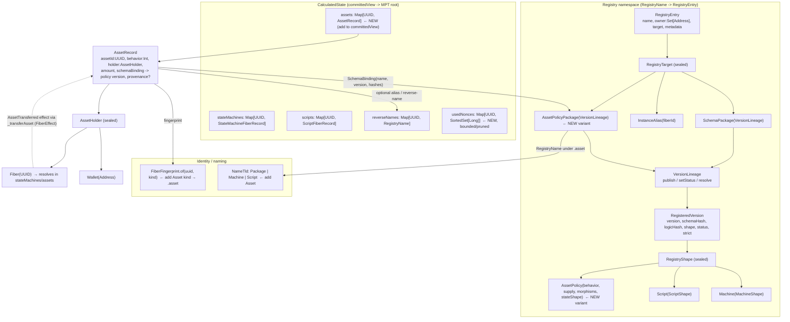

# Asset Model — RFC (v2)

**Status:** draft / design. **Date:** 2026-06-15.

This v2 supersedes the 2026-06-12 draft and folds in the review at
`docs/proposals/asset-model-review-and-interop.md`. The central structural change is that an asset
policy is no longer a free-standing UUID record — it is a **registry package** (`RegistryTarget` over
`VersionLineage`), so policies inherit versioning, ownership, governance, naming, fingerprints,
conformance typing, and committed-state provability from the machinery the chain already has. The
formalism is corrected: the behavior `meet` is the greatest-lower-bound on a product lattice with the
`E`/`G` factors order-reversed, the "monoidal category" framing is dropped, and the false
"soulbound dominates" claim is replaced with the checkable behavior homomorphism.

**Goal:** make assets a first-class citizen at the metagraph layer — typed, composable, and
law-enforced — by *unifying* them with the registry/fiber/naming machinery rather than paralleling it,
while keeping governance and business logic in JSON Logic where it belongs.

**Companion proposals:**
- `docs/proposals/asset-interop-functor.md` (cross-chain interop & provenance — the interop functor
  `F : Ext → Otto`, `OriginProvenance`, canonical-`policyId`-from-origin; spun out of this RFC's review §3)
- `docs/proposals/jlvm-engine-foundations.md` (engine substrate)
- `docs/proposals/versionable-contracts.md` (versioning model)
- `docs/proposals/schema-architecture.md` (registry / schema commitment model)
- `docs/proposals/naming-and-fingerprints.md` (`RegistryName`, proquint fingerprints, "Never a bare UUID")
- `docs/proposals/strong-typing-and-conformance.md` (`SchemaShape` / `ConformanceChecker`, the strict gate)
- `docs/signing-canonical-and-validation.md` (the three invariants this must respect)

---

## 0. Today (baseline)

Tokens exist only as convention inside `StateMachineFiberRecord.stateData` — an opaque `JsonLogicValue`.
There is no metagraph-level concept of "this fiber is a token," no typed behavior enforcement, and no
supply tracking. Whether an operation is permitted (e.g. transferring a soulbound token) depends entirely
on JSON Logic guards that can be misconfigured or omitted. An indexer cannot discover token behavior
without parsing the fiber's definition. There is no composition primitive.

The research project `~/repos/research-tdeg-2026/` validated a 16-type TDEG classification scheme and
`~/repos/ottochain-sdk/` has a TypeScript SDK spec for it. The design here supersedes those with a
cleaner model derived from categorical analysis and externally validated against seven on-chain asset
ecosystems (see the cross-network landscape in the review §1).

---

## 1. Design principles

1. **Structural invariants belong at the Scala layer.** Whether a morphism is geometrically possible
   (e.g. composing a `C=0` token) must be enforced before JSON Logic runs. A misconfigured guard should
   not be able to permit an impossible operation.

2. **Supply policy is orthogonal to instance behavior.** Whether new supply can be created (mintable)
   or destroyed (burnable) is a policy concern, not a behavioral flag on instances.

3. **Morphisms are typed.** Every transformation has a known domain-guard predicate and a deterministic
   codomain computation. Fractionalization is not an opaque state transition — it is a typed morphism
   `NFT → Shards` with an enforceable codomain.

4. **The algebraic laws are enforcement tools, not theory.** Composition is a commutative aggregation
   monoid; behavior is a strict homomorphism over it (`meet` of components); morphism sequences must
   type-check end-to-end against a partial typed graph. These are combiner-level checks. (See §4 — we do
   **not** claim a monoidal category.)

5. **L1 gets enough to reject bad updates fast.** A small set of safe behavior bits is pushed to
   `OnChain` so L1 can do structural rejection of morphisms on unknown/incompatible assets without
   touching `CalculatedState`.

6. **JSON Logic governs policy, not structure.** Who can mint, spend policy conditions, governance
   thresholds, time windows — all stay in JSON Logic. The Scala layer enforces what is *possible*;
   JSON Logic enforces what is *permitted by policy in context*.

7. **Signing-canonical invariant respected throughout.** All new `OttochainMessage` fields are either
   `Option[T]` (omit-safe) or required with no default. No `Boolean = false` or `SortedMap = empty`
   on signed messages. See `docs/signing-canonical-and-validation.md` (invariant #1).

8. **Assets UNIFY with the registry/fiber/naming machinery rather than parallel it.** An asset policy is
   a registry package (`VersionLineage`); an asset instance pins a `SchemaBinding` to a policy version
   exactly as a state-machine fiber pins a schema. No second governance surface, no second identity scheme.

9. **Cross-chain identity/provenance is carried as an `Option` field.** `Option[OriginProvenance]` on
   the asset record/policy, with a canonical `policyId` deterministically derived from origin. The full
   interop story (the functor `F`, the round-trip retraction, the fragmentation cure) is specified in
   `docs/proposals/asset-interop-functor.md` and is **not** duplicated here.

---

## 2. The 5-bit behavior model

The original TDEG 4-bit model conflated instance operations with supply concerns and collapsed
splittable+combinable into a single `D` flag. This design restores the original intent with five
independent bits.

| Bit | Flag | Name | Meaning |
|-----|------|------|---------|
| 16 | T | transferable | Instance can change holder |
| 8 | S | splittable | One instance → many fractions |
| 4 | C | combinable | Many instances → one |
| 2 | E | expirable | Time/ordinal-bounded |
| 1 | G | governable | Policy gates operations |

32 types (0–31). `S` and `C` are independent: a concert ticket is `T=1, S=0, C=0, E=1` (transferable
between buyers, can't split a seat, seats don't merge, expires at event time). A fractionalized NFT's
shards are `T=1, S=1, C=0, E=0` (fungible shards, not recombinable by design).

### Canonical presets

| Name | Bits | Decimal |
|------|------|---------|
| Soulbound | ----- | 0 |
| ExpiringBadge | ----E | 2 |
| ExpiringGovernedBadge | ---EG | 3 |
| NFT | T---- | 16 |
| Ticket | T--E- | 18 |
| GovernedTicket | T--EG | 19 |
| Fungible | TSC-- | 28 |
| GovernedFungible | TSC-G | 29 |
| ExpiringFungible | TSCE- | 30 |
| FullFeatured | TSCEG | 31 |

### The behavior lattice — order, meet, top, bottom (formalism correction)

The v1 stated the per-bit `meet` table but never stated the **order** it is the greatest-lower-bound
*of*. The order is a product lattice with the `E`/`G` factors **reversed**:

```
a ≤ b  ⟺  (a.T ≤ b.T ∧ a.S ≤ b.S ∧ a.C ≤ b.C)        — T,S,C under Boolean  false < true
        ∧ (a.E ≥ b.E ∧ a.G ≥ b.G)                      — E,G under the REVERSED order  true < false
```

So `(𝓑, ≤)` is the product lattice **(𝔹,≤)³ × (𝔹,≥)²** — three factors ordered the usual way, two
order-reversed (acquiring expiry or governance means moving *down* the lattice, i.e. becoming more
restricted). The composition behavior operation is then *literally the componentwise greatest lower
bound*:

```
meet(a,b) = (a.T ∧ b.T,  a.S ∧ b.S,  a.C ∧ b.C,  a.E ∨ b.E,  a.G ∨ b.G)
```

(The `∨` on `E`/`G` is the `∧` of the reversed factor.) `meet` is idempotent, commutative, associative,
and `meet(a,b) ≤ a` and `≤ b`. On this lattice:

- **TOP = 28 (TSC, Fungible)** — most capable, least restricted.
- **BOTTOM = 3 (EG)** — non-transferable, expirable, governable: most restricted reachable point.
- **`Soulbound = 0` is an INTERIOR point, not the bottom.**

This is one definition and one theorem; the proposed combiner code is unchanged. It is the precise
property `AssetMorphismLawSuite` asserts (`meet(a,b) ≤ a`, plus idempotence/commutativity/associativity).

### Composition behavior — the homomorphism, not the folk-claim (correction)

The v1 claimed *"a basket containing a soulbound token IS soulbound."* **This is false** under the
stated `E`/`G`-OR semantics. Because `Soulbound = 0` is an interior point (not the bottom), composing
with a soulbound component forces `T/S/C` **off** but can **ACQUIRE** `E` and/or `G` from a partner:

```
meet(Soulbound = 0, GovernedFungible = 29) = 1 = G    // the basket GAINS governance — it is NOT soulbound
```

The correct, checkable invariant is the **behavior homomorphism** (the strongest categorical content in
the model, §4):

```
behavior(Compose(xs)) = foldMeet(map(behavior, xs))     // never the "soulbound dominates" folk-claim
```

The only coordinates a soulbound component *forces off* are `T/S/C`; it makes **no** guarantee about
`E/G`. This `E/G`-acquisition is a **security-relevant property tooling MUST surface**: an integrator
must not assume "putting my non-governed asset in a basket cannot make it governed" — under these
semantics it can. (Design decision: we keep `E`/`G` as OR — "acquiring expiry/governance is restrictive"
— rather than switching to a plain `𝔹⁵` cube; the consequence is exactly the reversed lattice and the
caveat above.)

---

## 3. Supply policy (orthogonal to behavior)

Mint/burn authority is a *policy* set at policy-creation time, not a behavioral flag on instances.
Decoupling this from instance flags keeps the behavior model clean and prevents supply-level decisions
from leaking into instance-level type checks. The supply policy now lives **inside the registry package**
— it is part of the `RegistryShape.AssetPolicy` projection on a `RegisteredVersion` (see §5), not a
field on a free-standing UUID record:

```scala
final case class SupplyPolicy(
  maxSupply:  Option[Long],                // hard cap; None = uncapped
  mintPolicy: Option[JsonLogicExpression], // None = minting closed after genesis
  burnPolicy: Option[JsonLogicExpression], // None = no burning
  decimals:   Option[Int]                  // S=1 fungibles; None / 0 for NFTs (interop normalization)
)
```

Total supply is **derived** — `sum(record.amount for record in assets where policyId == p)` — rather
than stored as a mutable counter. The combiner maintains `totalMinted` as a **cached derived field**, but
the ground truth is always the record set (UTxO-style auditability without the full UTxO spending model).
Keeping `totalMinted` derived-and-cached rather than a hot mutable counter avoids the parallel-mint
contention pitfall (Aptos's lesson: a max-supply *counter* serializes mint/burn). Amount conservation
(`Σ inputs = Σ outputs ± policy-path mint/burn`) is an explicit combiner invariant — OttoChain has no
linear types, so this re-implements Move's free guarantee as a deterministic check (§7 law suite).

### Policy lifecycle & instance semantics (the resolve-asymmetry invariant)

An asset policy is a registry package (§5), so it inherits the registry version lifecycle verbatim
(`VersionLineage.setStatus`, `RegistryStatus`):

```
Active      — mintable + recommended.            resolve() selects it.
Deprecated  — still resolvable + mintable, discouraged for new instances (reversible ↔ Active).
Yanked      — NOT mintable: resolve() EXCLUDES it. Terminal.
```

Every existing `AssetRecord` pins its policy version via `SchemaBinding` *for life* (the same "pin once at
mint; re-resolution is an explicit upgrade" rule fibers use). So an instance keeps functioning through any
status change of its policy version — **assets are never auto-burned on yank.**

**The resolve-asymmetry invariant (load-bearing — anti-rug-pull):**

| Path | Lineage lookup | Effect of yanking the version |
|------|----------------|-------------------------------|
| **Mint** (`MintAsset`) | `VersionLineage.resolve` | a yanked version **BLOCKS new mints** (`resolve` excludes `Yanked`). |
| **Morphisms** on existing instances (`ApplyMorphism`: Transfer/Burn/Compose/Decompose/…) | **direct `versions.get(schemaBinding.version)`** | the pinned version is returned **regardless of status**, so existing instances **keep working**. |

This asymmetry is deliberate and must not be "unified." If morphism resolution switched to `resolve()`,
yanking a policy version would retroactively **brick every existing instance** (a Transfer/Burn would
suddenly fail to resolve) — i.e. a **rug-pull**: an owner could trap holders' assets by yanking. The mint
path uses `resolve` so an owner *can* close off new supply (the legitimate use of yank); the morphism path
uses the direct pinned lookup so it can *never* strand assets already in holders' hands. The asymmetry is
enforced in `AssetCombiner` (`resolvePolicy` = mint, `resolve`; `resolveAssetPolicy` = morphisms, direct
`versions.get`) and guarded by a combiner test (a yank blocks a new mint but leaves an existing instance's
Transfer succeeding, unchanged-except-holder, not burned).

> **Optional future "frozen yank" (non-default).** A policy could opt into a stricter yank that limits
> existing instances to **exit-only** morphisms (Transfer/Burn) — letting holders withdraw but freezing
> further composition/state change — as a *policy choice*, never the default (the default keeps full
> functionality through yank). This would be modeled as a policy-version flag read combiner-only (rule #3),
> not a change to the resolve-asymmetry above.

> **Implementation note (gap).** `RegistryCombiner.setVersionStatus` (the `SetVersionStatus` op) today
> handles only `RegistryTarget.SchemaPackage` (machine/script) lineages — it raises `CombineRejected` for an
> `AssetPolicyPackage`. So *on-chain* yanking of an asset policy needs `setVersionStatus` to learn the asset
> variant (a small additive change, parallel to the alias-dispatch gap in §5c). The lifecycle primitive
> (`VersionLineage.setStatus`) already supports it; only the op dispatch is missing.

---

## 4. Typed morphisms

A morphism is a typed transformation with a **domain guard** (a predicate on the behavior `β`) and a
**codomain function** (`β ↦ β'`). The collection of morphisms is a **partial typed graph, not a
(monoidal) category** — see the algebra below.

### Morphism kinds (domain guard / codomain)

| Kind | Domain guard | Codomain |
|------|-------------|----------|
| Transfer | `T=1` | same behavior, new holder |
| Burn | (none) | asset destroyed (terminal) |
| Fractionalize | `S=1` | shards: source behavior with `C` forced to `0` |
| Compose | all components `C=1` | `meet(all component behaviors)` |
| Decompose | `isComposite` | original component behaviors restored |
| Wrap | `T=1` | same behavior (identity-preserving on `β`) |
| Stake | `T=1` | source behavior with `E:=1` (moves *down* the lattice) |

Codomain rule for Fractionalize: shards inherit the source behavior but with `C=0`. A subsequent Compose
of those shards is structurally rejected (`C=0`) before any policy runs — the law is the morphism's
codomain function, not a JSON Logic guard.

### Why it is NOT a category (framing correction)

The v1 called this a "monoidal category" with "monoidal laws." That overclaims. There is no identity
arrow (`Wrap`/`Transfer` change custody/instance identity — they are *not* no-ops on the object), and
composition is **partial** (`Fractionalize` → `C=0`, then `Compose` needs `C=1` → rejected). There is no
tensor unit, no associator/unitor, no coherence. We call it a **typed morphism graph with domain
guards**; "a morphism chain type-checks" means typed-graph reachability, checked by the L1 structural
layer. The implementation is plain combiner functions (`validateStructural` / `codomainBehavior`), **not**
a Scala `Category` trait (the Cell/god-object trap; see `docs/TOPOS-FIBER-CATEGORICAL-ASSESSMENT.md`).

### The two genuine algebraic facts (combiner invariants)

These — not "monoidal laws" — are what the law suite checks:

1. **Commutative aggregation monoid.** Components compose by **multiset-union** of
   `componentFiberIds`; the unit is the **empty multiset** (the unit/empty composite maps to the lattice
   top, `28`). `Compose` is union. `Decompose ∘ Compose = id` is a **RETRACTION** — a *left* inverse. It is
   **not** two-sided: `Compose ∘ Decompose` is **not** claimed (and must not be asserted in the law suite).

   **FAITHFUL retraction (Phase-4 hardening).** The retraction is realized FAITHFULLY: at `Compose` the
   combiner builds a canonical (sorted-by-`assetId`) `List[ComponentWitness]` capturing each part's full
   restorable state — `(assetId, schemaBinding, behavior, holder, amount, expiresAt, componentFiberIds,
   componentsCommitment, provenance)` — and stores `componentsCommitment = hash(canonicalWitnesses)` on the
   composite (alongside `componentFiberIds` verbatim, for the id-multiset and the L1 commit). `Decompose`
   takes a **mandatory reveal witness** (`ApplyMorphism.priorComponents`), recomputes the hash, requires it
   to equal the stored commitment, requires the witness id-set to equal `componentFiberIds`, requires
   `Σ witness.amount == composite.amount`, and then restores each component EXACTLY (its own behavior /
   holder / amount / binding / nested anchors — modulo reset creation/latest ordinals + sequence). So
   `Decompose ∘ Compose = id` holds on the full **component state**, not merely the id multiset — A and B
   with different behaviors/holders/amounts come back as themselves; the composite's `foldMeet` behavior and
   source-holder custody do **not** leak onto the restored components. This is **choice (a), STRICT**: a
   committed composite MUST decompose faithfully — there is **NO lossy fallback**; a missing / mismatched /
   non-conserving witness is a graceful `CombineRejected`. The `componentsCommitment` is recursive (a
   restored component can itself be a composite and decompose faithfully).

2. **Behavior homomorphism.** `behavior : (AssetAggregate, ⊎) → (𝓑, meet)` is a **strict monoid
   homomorphism**: `behavior(Compose(xs)) = foldMeet(map(behavior, xs))`, with the empty aggregate ↦
   top `28`. This is the strongest categorical content in the model. The combiner recomputes the meet and
   rejects (`CombineRejected`) if it does not match the stored bits — and recomputes from the
   **authoritative `AssetRecord`**, never from the (stale-by-design) `OnChain` commit bits.

`meet` is associative and commutative on `TokenBehavior`, so nesting composites is order-independent: a
basket of `[basket of [A, B], C]` has the same behavior as `[A, B, C]`.

---

## 5. The registry-package model (the central structural change)

The chain already has exactly one shape for "a versioned type whose instances are minted against it, with
append-only governance" (a registry package over `VersionLineage`) and exactly one shape for "a deployed
instance that pins which version it is" (a record carrying a `SchemaBinding`). **An asset policy is the
former; an asset instance is the latter.** Nothing new is needed at the spine level — only new *variants*
of existing sealed traits. The spine to internalize: **policy : asset :: package : fiber.**

### (a) `AssetPolicy` = a versioned registry package

`RegistryTarget` is a sealed trait — `SchemaPackage(VersionLineage) | InstanceAlias(fiberId)` — with a
literal `TODO(#29 phase 4)` inviting a third variant. Add the asset variant:

```scala
// RegistryTarget.scala — add alongside SchemaPackage / InstanceAlias
final case class AssetPolicyPackage(versions: VersionLineage) extends RegistryTarget
```

`behavior + supply + morphisms` move into a new `RegistryShape` variant alongside `Machine` / `Script`,
carried on the existing `RegisteredVersion.shape`:

```scala
// SchemaShape.scala — RegistryShape sealed trait, add alongside Machine / Script
final case class AssetPolicy(
  behavior:    TokenBehavior,
  supply:      SupplyPolicy,
  morphisms:   SortedMap[MorphismKind, MorphismSpec],
  stateShape:  MessageShape                    // the asset-state schema, for the strict conformance gate (§5d)
) extends RegistryShape
```

Then publishing / upgrading / deprecating / yanking a policy reuses `VersionLineage.publish` /
`setStatus` / `resolve` **verbatim** — append-only, monotonic, `Active`/`Deprecated`/`Yanked` for free.
Ownership and governance come from `RegistryEntry.owner: Set[Address]`, identical to every other
artifact. This directly **answers open-Q2** (registerable custom morphisms): a custom morphism is just a
new policy *version*, no protocol upgrade.

This **DELETES** the free-standing `CalculatedState.assetPolicies` UUID map. Policies get a
human-readable, owned, fingerprintable `RegistryName` instead of a bare UUID.

### (b) Asset instances = records bound via `SchemaBinding`

An asset instance has no JSON-Logic definition of its own — its behavior lives in its bound policy
version. So it is **NOT** a `FiberRecord`. It is a first-class record in its own
`CalculatedState.assets: SortedMap[UUID, AssetRecord]` map that pins a
`SchemaBinding(name, version, schemaHash, logicHash)` to its policy package version — exactly as
`StateMachineFiberRecord.schemaBinding` pins a machine to its schema today ("pin once at mint;
re-resolution is an explicit upgrade"; the chain verifies the binding on-chain). This resolves the v1
contradiction (the v1 had `AssetRecord extends FiberRecord` **and** a parallel `assets` map).

> Alternative considered: an asset instance *could* be expressed as an ordinary fiber in `stateMachines`
> — a tiny state machine whose transitions are the morphisms — unifying into the existing map with zero
> new top-level state. Both are coherent; we pick the **dedicated `AssetRecord`** for clarity of custody
> and supply auditing (a held balance and a derived-supply ledger are awkward to read out of generic
> fiber `stateData`).

### (c) Identity & naming, against the real stack

Assets must stop being the only on-chain objects with no readable handle. Honor
`naming-and-fingerprints.md`'s **"Never a bare UUID"**: audit trails render `nickname (fingerprint)`.

- **Policy identity = `RegistryName`** under a new `NameTld.Asset` (the enum is sealed; today
  `Package | Machine | Script`). Owned, versioned, human-readable.
- **Instance identity = UUID + a proquint fingerprint.** Add an `Asset` kind so `FiberFingerprint.of`
  can suffix `.asset` (the encoder today knows only `machine`/`script` via `FiberKind`; add an `Asset`
  case to `FiberKind`, or a parallel kind, so `tld` covers assets). The fingerprint is the checksummed,
  offline-verifiable anchor — `lusab-…-bavor.asset`.
- **Alias dispatch.** The `RegistryCombiner` alias path today routes `NameTld.Machine → stateMachines`,
  `NameTld.Script → scripts`, and raises `CombineRejected` for anything else; it **must learn the assets
  map** (and the policy package) or an asset can never receive a name. Alias granularity: per-policy
  names are clearly wanted (the policy already gets one as a package); per-instance aliases for
  high-cardinality tokens are likely undesirable — but if offered, the dispatch above is the gate.

### (d) Asset STATE typing via `ConformanceChecker` / `SchemaShape`

The model types asset *behavior* (the 5 bits) and must also type asset *state* (`amount`, `holder`,
`expiresAt`, `componentFiberIds`). Carry a `MessageShape` on `RegistryShape.AssetPolicy.stateShape` and
gate **produced** asset state on mint and on every morphism via `ConformanceChecker.violationsFor` on
**strict** versions — the same strict gate that validates produced state for strict machines
(`RegisteredVersion.strict`). This connects assets to the existing `FieldShape` → `MessageShape` →
strict-conformance pipeline (`strong-typing-and-conformance.md`), consistent with the "describe + bind,
don't constrain the JLVM logic" principle.

### (e) Fiber-as-asset-holder custody — keep it (see §10)

`AssetHolder = Wallet(Address) | Fiber(UUID)` integrates cleanly with real machinery; the detail is in
§10. One combiner rule stated here: `holder = Fiber(x)` must point at a **live, non-archived** record
(the combiner reads `stateMachines`/`assets`, which is allowed in combine), and the asset and fiber UUID
namespaces must be disambiguated so an `assetId` cannot be mistaken for a `fiberId`.

> **Invariant to carry forward (CLAUDE.md rule #3).** Now that `AssetPolicy` is a registry package, any
> morphism-time policy/lineage/nonce lookup reads `CalculatedState.registry` *lineage* and **MUST stay
> combiner-only as `CombineRejected`** — never in `validateSignedUpdate`. Layer 1 reads only
> `AssetCommit.behavior` (a safe `OnChain` int). See §6.

### Entity-relationship diagram



---

## 6. Validation architecture

### Three layers

```
Layer 1 — Structural (pure flag check, O(1), no CalculatedState):
  Is this morphism geometrically possible for this behavior?
  C=0 → Compose rejected. S=0 → Fractionalize rejected. Malformed directive rejected.
  Reads ONLY OnChain.AssetCommit.behavior (a safe Int). No JSON Logic, no registry lineage.

Layer 2 — Policy (registry lineage: AssetPolicy version + allowlists):  COMBINER ONLY
  Is this morphism defined for this policy version? Is the counter-party on the allowlist?
  Reads CalculatedState.registry lineage → graceful CombineRejected. Runs if Layer 1 passes.

Layer 3 — JSON-Logic guard (Governed morphisms only):  COMBINER ONLY
  Does MorphismSpec.guard pass given the current context? Metered via MeteredEvaluator.
  Runs if Layers 1+2 pass.
```

### The CLAUDE.md rule #3 boundary (explicit, for policy-as-package)

Because `AssetPolicy` is now a registry package, **all** morphism-time policy/lineage/nonce/supply
lookups read `CalculatedState.registry` lineage (and `assets`/`usedNonces`). Per CLAUDE.md rule #3 these
**MUST stay combiner-only as graceful `CombineRejected`** and **NEVER** appear in `validateSignedUpdate`.
A stateful asset/policy/nonce lineage read in the block-acceptance gate is a TOCTOU block-poisoning
hazard: a concurrent publish/mint/yank flips a once-valid update to `Invalid` at ML0 re-validation, and
tessellation drops the **entire DL1 block** (all-or-nothing) for every tx batched in it. This mirrors the
registry path in `Validator.validateSignedUpdate`, which dispatches registry ops to an L1-structural-only
path with the `RegistryCombiner` as the authoritative gate. Every new `AssetValidator` method that takes
a `policyId`, `nonce`, `compositeId`, or `SchemaRef`/`SchemaBinding` must be reviewed against this rule.

### L1 fast-path: `AssetCommit` on `OnChain`

To let L1 reject structurally-invalid morphisms without a `CalculatedState` round-trip, a *safe* subset
of behavior bits plus a sequence number are pushed to `OnChain`. `OnChain` today carries
`fiberCommits`, `latestLogs`, `registryCommits`; add an asset commit map:

```scala
final case class AssetCommit(
  behavior:       Int,                     // 5-bit bitmask — the safe value for the L1 structural check
  sequenceNumber: FiberOrdinal,
  recordHash:     Hash,
  origin:         Option[OriginDiscriminator] = None   // forward-ref: interop double-wrap fast-reject (interop RFC)
)

// add to OnChain:
//   assetCommits: SortedMap[UUID, AssetCommit] = SortedMap.empty
```

`AssetCommit.behavior` is **advisory and inherently stale** (the L1 sequence comparison is batching-
tolerant, `commit.sequenceNumber <= targetSequenceNumber`). Therefore the **combiner re-derives behavior
from `CalculatedState.assets(...).behavior`, never from the commit bits**, before computing
`meet`/codomain.

L1 structural check on `ApplyMorphism` (structural only — CLAUDE.md invariant):

```scala
// In validateSignedUpdate / validateUpdate (NO CalculatedState, NO registry lineage)
state.assetCommits.get(msg.assetId) match {
  case None         => Invalid("asset not found")        // hard reject (resolves open-Q3)
  case Some(commit) =>
    val b = TokenBehavior.fromBits(commit.behavior)
    msg.kind match {
      case Transfer      => Either.cond(b.transferable, (), Invalid("T=0: soulbound"))
      case Fractionalize => Either.cond(b.splittable,   (), Invalid("S=0: indivisible"))
      case Compose       => Either.cond(b.combinable,   (), Invalid("C=0: not combinable"))
      case Decompose     => Right(())     // combiner checks isComposite; L1 only verifies asset exists
      case _             => Right(())
    }
}
```

Sequence-number monotonicity for `Sequenced` asset ops is checked the same way as fiber ops, via
`commit.sequenceNumber`. **Hard vs soft reject (resolves v1 open-Q3 as hard-reject):** structural
failures that can *never* succeed at the combiner — malformed directive, unknown asset, sequence-number
violation — **hard-reject** at L1, consistent with `FiberRules.L1.sequenceNumberMatches`. Everything
stateful (policy, nonce, supply, lineage) is **soft** — `CombineRejected` only.

A subtlety: a **fiber-internal** transfer originates from a transition result, not a signed `AssetOp`, so
there is nothing for the L1 `AssetCommit` path to check on that route — fiber-internal transfers are
gated purely in the combiner (§10).

---

## 7. New types and files (against the REAL current shapes)

The v1 §7 cited stale shapes (`stateMessage: String`, `RegistryEntry.versions`, `NameRecord`). The
re-baselined facts: `RegistryEntry(name, owner, target, metadata)` with versions *inside*
`RegistryTarget`; `RegisteredVersion(version, schemaHash, logicHash, shape, status, registeredAt,
strict)`; `RegistryShape (Machine | Script)`; `MachineShape(stateMessage: MessageShape, commands:
SortedMap[String, MessageShape])`; `FiberKind (StateMachine | Script)`; `NameTld (Package | Machine |
Script)`; `OnChain(fiberCommits, latestLogs, registryCommits)`; `CalculatedState(stateMachines, scripts,
registry, reverseNames)`; `FiberEffect (Triggered | Spawned | Emitted)`; `FiberResult.Success(...)`
(no asset field today).

### Registry-spine additions

- `RegistryTarget += AssetPolicyPackage(versions: VersionLineage)`.
- `RegistryShape += AssetPolicy(behavior, supply, morphisms, stateShape)` — give it `customizableEncoder/
  Decoder` and add its branch to the `RegistryShape` encoder/decoder (the natural field-name
  discriminator is the inner `behavior`/`supply` keys).
- `NameTld += Asset` (the enum is `enumeratum`; lowercase entry name `asset`).
- `FiberKind += Asset` (or a parallel kind), so `FiberFingerprint.tld` maps it to `"asset"` and
  `FiberFingerprint.of(uuid, kind)` suffixes `.asset`.

### `modules/models/src/main/scala/xyz/kd5ujc/schema/asset/`

**`TokenBehavior.scala`** — document the lattice order in scaladoc (the reversed `E`/`G` factors):

```scala
/**
 * 5-bit instance behavior. The lattice order is the product (𝔹,≤)³ × (𝔹,≥)² — T/S/C ascending,
 * E/G DESCENDING. `meet` is the componentwise glb on that lattice. TOP = 28 (Fungible), BOTTOM = 3 (EG).
 * Soulbound = 0 is an INTERIOR point. See asset-model.md §2.
 */
final case class TokenBehavior(
  transferable: Boolean, splittable: Boolean, combinable: Boolean,
  expirable: Boolean, governable: Boolean
) {
  val bits: Int = (if (transferable) 16 else 0) | (if (splittable) 8 else 0) |
                  (if (combinable) 4 else 0) | (if (expirable) 2 else 0) | (if (governable) 1 else 0)
  def meet(o: TokenBehavior): TokenBehavior = TokenBehavior(
    transferable && o.transferable, splittable && o.splittable, combinable && o.combinable,
    expirable || o.expirable, governable || o.governable)
  def le(o: TokenBehavior): Boolean =
    (!transferable || o.transferable) && (!splittable || o.splittable) && (!combinable || o.combinable) &&
    (expirable || !o.expirable) && (governable || !o.governable)
}
object TokenBehavior {
  val Top: TokenBehavior = fromBits(28)    // unit / empty-composite object
  def fromBits(n: Int): TokenBehavior = ...
  def foldMeet(xs: List[TokenBehavior]): TokenBehavior = xs.foldLeft(Top)(_ meet _)
}
```

**`AssetPolicy.scala`** — `MorphismKind`, `MorphismVisibility`, `MorphismSpec`, `SupplyPolicy`:

```scala
sealed trait MorphismKind          // Transfer | Burn | Fractionalize | Compose | Decompose | Wrap | Stake
sealed trait MorphismVisibility    // Public | Governed | Disabled
final case class MorphismSpec(
  visibility:      MorphismVisibility,
  allowedPolicies: Option[Set[RegistryName]],   // counter-party policy allowlist; None = any
  allowedTypes:    Option[Set[Int]],            // counter-party behavior-bitmask allowlist; None = any
  guard:           Option[JsonLogicExpression]
)
final case class SupplyPolicy(maxSupply: Option[Long], mintPolicy: Option[JsonLogicExpression],
                              burnPolicy: Option[JsonLogicExpression], decimals: Option[Int])
```

### `Updates.scala` — `sealed trait AssetOp` (+ `OttochainMessage`)

Every optional field is `Option[T]`; **no non-`Option` field with a default** (invariant #1). Add each
variant to the `OttochainMessage` `messageEncoder`/`messageDecoder` dispatch lists, and a case to
`PublishVersionSigningCanonicalSuite`.

```scala
sealed trait AssetOp

// Publish a policy PACKAGE version (npm-publish semantics, like PublishMachineVersion):
final case class CreateAssetPolicy(
  name:        RegistryName,             // .asset TLD
  version:     SemVer,
  behavior:    TokenBehavior,            // required, no default
  supply:      SupplyPolicy,             // required (its inner fields are Option)
  morphisms:   SortedMap[MorphismKind, MorphismSpec],  // required map (presence required; emptiness meaningful)
  stateShape:  MessageShape,             // required
  metadata:    Option[SortedMap[String, String]] = None
) extends AssetOp with OttochainMessage { val fiberId: UUID = RegistryOp.routingId(name) }

final case class MintAsset(
  assetId:     UUID,                     // the new instance id
  policyRef:   SchemaRef,                // (RegistryName, VersionReq) → resolved + pinned at combine
  holder:      AssetHolder,              // required
  amount:      Long,                     // required
  expiresAt:   Option[SnapshotOrdinal] = None,
  provenance:  Option[OriginProvenance] = None   // forward-ref, interop RFC; Option per invariant #1
) extends AssetOp with OttochainMessage { val fiberId: UUID = assetId }

final case class ApplyMorphism(
  assetId:              UUID,
  kind:                 MorphismKind,
  targetSequenceNumber: FiberOrdinal,     // required (Sequenced)
  recipient:            Option[AssetHolder] = None,
  otherAssets:          Option[List[UUID]] = None,
  compositeId:          Option[UUID]       = None,
  shardIds:             Option[List[UUID]] = None,
  nonce:                Option[Long]       = None   // for delegated/symmetric morphisms
) extends AssetOp with OttochainMessage with Sequenced { val fiberId: UUID = assetId }

final case class AuthorizeCompose(
  assetId:              UUID,
  partnerPolicy:        RegistryName,
  nonce:                Long,
  expiresAt:            SnapshotOrdinal,   // ordinal-based, no wall-clock
  targetSequenceNumber: FiberOrdinal
) extends AssetOp with OttochainMessage with Sequenced { val fiberId: UUID = assetId }
```

### `Records.scala` — `AssetRecord` (NOT a `FiberRecord`)

```scala
final case class AssetRecord(
  assetId:           UUID,
  schemaBinding:     SchemaBinding,        // pins (RegistryName, version, schemaHash, logicHash) to the policy version
  behavior:          Int,                  // cached from the bound policy version (authoritative copy here)
  holder:            AssetHolder,
  amount:            Long,
  status:            FiberStatus,          // Active / Archived — for the live-record holder check
  creationOrdinal:   SnapshotOrdinal,
  latestUpdateOrdinal: SnapshotOrdinal,
  sequenceNumber:    FiberOrdinal,
  expiresAt:         Option[SnapshotOrdinal] = None,
  componentFiberIds: Option[List[UUID]]     = None,   // present iff composite; stored verbatim (retraction)
  parentCompositeId: Option[UUID]           = None,
  provenance:        Option[OriginProvenance] = None  // forward-ref → asset-interop-functor.md
)
```

The policy is a registry package (`AssetPolicyRecord-as-registry`): it lives in `CalculatedState.registry`
as a `RegistryEntry(name, owner, AssetPolicyPackage(versions), metadata)` — there is **no** separate
`AssetPolicyRecord` type and **no** `assetPolicies` map. `totalMinted` is derived from `assets` (cached
in an index, not stored as a signed field).

### `CalculatedState.scala`

```scala
// add to CalculatedState:
assets:     SortedMap[UUID, Records.AssetRecord]  = SortedMap.empty,
usedNonces: SortedMap[UUID, SortedSet[Long]]      = SortedMap.empty   // BOUNDED — pruned past expiresAt in combine

// DELETE: assetPolicies (policies live in `registry` as AssetPolicyPackage)
```

**Committed-state projections (mandatory — total or consensus halts).** `committedView.entries`
currently enumerates `fiber/`, `script/`, `registry/`, `reverse/`. Add **TOTAL** `CommitKey` projections
or the new state is off-root and unprovable to light clients (and a non-total key throws inside combine =
consensus halt). Asset policies are already covered by the existing `registry/<name>` projection (they
are `RegistryEntry`s); add the instance and nonce namespaces:

```
asset/<uuid>          from `assets`
nonce/<uuid>          from `usedNonces` (the SortedSet[Long] value needs a total deterministic encoding)
```

`StateProofHandler` gains an `asset(id)` method mirroring `stateMachine`/`script` so custody is
light-client provable under `calculatedStateProof`. **Bounded growth:** `usedNonces` is monotonic; prune
entries past `expiresAt` during combine (or key by a bounded window) so the committed root and proof size
cannot grow unboundedly (DoS).

### `OnChain.scala`

```scala
// add to OnChain:
assetCommits: SortedMap[UUID, AssetCommit] = SortedMap.empty   // includes the optional origin discriminator
```

### New combiner module — `modules/sharedData/.../asset/AssetCombiner.scala`

```scala
def validateStructural(kind: MorphismKind, behavior: TokenBehavior): Either[CombineRejected, Unit]
def validatePolicy(kind, source, counterParties, policyVersion): Either[CombineRejected, Unit]   // reads registry lineage
def codomainBehavior(kind, source, others): TokenBehavior                                         // re-derived from records
def applyMorphism(msg, source, others, policyVersion, state): Either[CombineRejected, CalculatedState]
```

The combiner is the authoritative writer (single-pass, non-short-circuiting, signature-tiebreak total
order). It performs holder-ownership, supply-conservation, allowlist, nonce-consume, and behavior-
homomorphism checks (§8/§10), emitting `CombineRejected → RejectionReceipt` on failure.

### New test suite — `AssetMorphismLawSuite` (CORRECTED assertions)

Property tests over all 32 behaviors (and the 32×32×32 triples — cheap and total):

- `meet` is the **glb on the reversed lattice**: `meet(a,b).le(a)` and `.le(b)`; idempotent;
  commutative; associative.
- **Behavior homomorphism**, including the empty/unit case: `behavior(Compose(xs)) ==
  foldMeet(map(behavior, xs))`, and `foldMeet([]) == TokenBehavior.Top (28)`.
- **`Decompose ∘ Compose = id` as a RETRACTION** (stored `componentFiberIds` returned unmodified).
  **Do NOT assert** `Compose ∘ Decompose = id`.
- **Partial-graph rejection**: a typed chain rejects at the first domain-guard failure (e.g.
  `Fractionalize` then `Compose` → rejected on `C=0`).
- **Amount conservation**: every morphism conserves amount (`Σ inputs = Σ outputs ± policy-path
  mint/burn`).

---

## 8. Morphism access control

### Three visibility levels

```scala
sealed trait MorphismVisibility
case object Public    extends MorphismVisibility   // owner executes freely; no additional auth
case object Governed  extends MorphismVisibility   // JSON Logic guard must pass
case object Disabled  extends MorphismVisibility   // structurally closed for this policy version
```

### `MorphismSpec` on the policy version

Each policy version defines which morphisms are available and under what conditions
(`MorphismSpec(visibility, allowedPolicies, allowedTypes, guard)` — §7). Example, a resalable concert
ticket composable only with a certified resale policy:

```json
{
  "behavior": { "transferable": true, "splittable": false, "combinable": false,
                "expirable": true, "governable": true },
  "morphisms": {
    "Transfer":  { "visibility": "Public" },
    "Compose":   { "visibility": "Disabled" },
    "Wrap":      { "visibility": "Governed",
                   "allowedPolicies": ["certified-resale-v1.asset"],
                   "guard": { "<=": [{"var": "$ordinal"}, {"var": "policy.saleDeadline"}] } }
  }
}
```

### ZkVerify-gated morphisms (zk-as-integrity)

A `Governed` morphism's `guard` — and a `mintPolicy` guard — may REQUIRE a zero-knowledge proof or a
Merkle-membership proof carried on the transaction. The signed `ApplyMorphism` / `MintAsset` carries an
optional `witness: Option[JsonLogicValue]`, which the combiner exposes to the guard under the reserved
`witness` context key. The guard then calls one of metakit's already-wired, gas-metered verifier opcodes
(`groth16_verify`, `pmt_verify`, `poseidon`) over that witness:

```json
{ "morphisms": {
    "Transfer": { "visibility": "Governed",
                  "guard": { "pmt_verify": [ "<merkle-root>",
                                             {"var": "witness.leaf"},
                                             {"var": "witness.index"},
                                             {"var": "witness.siblings"} ] } } } }
```

or, for a proof-gated mint ("mint iff this membership/inclusion proof verifies"):

```json
{ "mintPolicy": { "groth16_verify": [ "<vkey>",
                                      {"var": "witness.publicValues"},
                                      {"var": "witness.proof"} ] } }
```

This is **pure wiring, no new cryptography**: the verifier opcodes already exist in metakit and run
DETERMINISTICALLY in the combiner through the same `JsonLogicEvaluator.evaluateWithGas` path every guard
uses (`AssetCombiner.evalGuardOrReject`) — one reused verifier, not a hand-rolled per-use check. A false
or failed verification is a graceful `CombineRejected`, never a snapshot abort (CLAUDE.md rule #2/#3:
combiner-only, stateful gate). Out of scope (intentionally): confidential amounts, homomorphic
commitments, shielded pools, nullifier sets, range proofs — any new crypto.

**CAVEAT (honest):** metakit's Groth16 / Poseidon-Merkle verifier has **no public security audit**. A
`ZkVerify`-gated guard is sound only up to the correctness of that verifier, so it **must not protect real
value** until metakit's verifier is independently audited.

### Symmetric composition (two holders) — commit-reveal nonce

When two assets from different holders are composed (e.g. an LP deposit), both must consent, via a
one-time linear nonce (the EIP-2612-`permit` shape, generalizable to any delegated morphism):

1. Holder A submits `AuthorizeCompose(assetId, partnerPolicy, nonce, expiresAt, targetSequenceNumber)` —
   a signed intent; the nonce is recorded in `CalculatedState.usedNonces`.
2. Holder B submits `ApplyMorphism(kind = Compose, …, nonce = Some(n))`. The combiner checks the nonce
   **exists ∧ not already in `usedNonces` ∧ `currentOrdinal ≤ expiresAt`**, atomically read-then-marks
   it consumed within a single `insert`, and writes back (signature-tiebreak picks a deterministic winner
   for two ops citing the same nonce; the loser gets `CombineRejected`).
3. The nonce is marked used (linear: one-time).

**`usedNonces` MUST be bounded** — prune entries past `expiresAt` during combine (committed-state growth
/ DoS, §7). Nonces should derive from a signed commitment including `lastSnapshotHash` (no grinding /
front-running), and the `expiresAt` comparison against `FiberContext.ordinal` needs a defined
inclusive/exclusive rule to stay node-deterministic.

---

## 9. Security

### Holder-ownership of `_transferAsset` is NOT guaranteed by the effect alone

`_transferAsset` / `AssetTransferred` carries **no authorization** by itself. `EffectExtractor` scrapes
reserved keys **verbatim** from whatever a transition computes; the only upstream gate is that the
transition *ran* (guard passed, update signed). That proves nothing about asset ownership — a malicious
or buggy fiber definition could emit a transfer of an asset it does not hold. **The defense MUST live in
the `AssetCombiner`, never trust the extracted effect:** when applying an `AssetTransferred`, resolve
`AssetTransferDirective.assetId` against `current.calculated.assets` and require:

- `holder == AssetHolder.Fiber(sourceFiberId)` (the *emitting* fiber), and
- `behavior.transferable`, and
- sufficient `amount`;

otherwise `CombineRejected`. This is the single highest-risk item in the design. (And per §5e/§10 the
target holder, if `Fiber(x)`, must resolve to a live, non-archived record.)

### The return channel must be wired end-to-end (it does NOT exist as drafted)

The §10 authorization diagram assumes a path that does not exist today: `FiberResult.Success` has **no**
asset field and `TransactionResult.Committed` carries only updated machines/scripts/logs/gas — so a
naive build that only adds the `FiberEffect` variant would compile, extract the effect, and **silently
drop it** between `FiberResult.Success` and `TransactionResult.Committed` (assets never move). Wire it:

```
FiberEffect.AssetTransferred(directive)
  → EffectExtractor.extractAssetTransfers   (reads ReservedKeys.TRANSFER_ASSET; metered via
                                             MeteredEvaluator.evalOpt under a new GasExhaustionPhase.Morphism)
  → FiberResult.Success.assetTransfers: List[AssetTransferDirective]   (safe to default ONLY because
                                             FiberResult is an in-process engine type, never a signed canonical)
  → buildSuccessOutcome → processStateMachineSuccess → completeStateMachineTransaction
    → both commitWithoutTriggers AND dispatchTriggers   (cascades merge maps; asset deltas need the same merge)
  → TransactionResult.Committed   (gains the asset channel; the script Success path defaults it empty)
  → withAssets on DataStateOps (mirrors withFibersAndScripts), applied in handleCommittedOutcome with the
    holder/policy checks above
```

`StateMerger` needs no change — `_`-prefixed keys are already filtered from merged `stateData`.

### Committed-state visibility (total keys) and bounded nonces

`assets` and `usedNonces` MUST be added as **TOTAL** `CommitKey` projections to `committedView.entries`
(`asset/<uuid>`, `nonce/<uuid>`; policies are already covered by `registry/<name>`) or they are invisible
to the calc-state MPT proof — light clients cannot verify token custody, the very objects that most need
it. A non-total key throws in combine (consensus halt). `usedNonces` must be pruned (DoS). See §7.

### Reentrancy and mutation bounding

Cascade cycle-detection keys on `(fiberId, eventName)`, so re-entering the same asset-holding fiber with
a *different* event is not a cycle — only `maxDepth = 10` bounds a cascade, permitting ~10 asset
mutations per transaction. Add an explicit `ExecutionLimits.maxAssetMutations` cap independent of depth,
and enforce `_transferAsset` **single-pass / non-reentrant per combiner pass** (the Aptos AIP-73 lesson;
OttoChain's in-VM JLVM guard avoids the SPL/Aptos CPI reentrancy class by construction). Inject
`heldAssets` via a holder-keyed index, not an O(all-assets) filter (gas/perf cliff).

---

## 10. Fiber-as-asset-holder

State machines (not scripts) are the correct custody primitive:
- `UpgradeFiber` + migration lets you fix escrow logic without abandoning held assets; scripts have no
  upgrade path.
- An explicit state model (`HOLDING → RELEASED → SETTLED`) is auditable; scripts are opaque.
- `schemaBinding` lets anyone verify the holding fiber runs a specific audited version.

### `AssetHolder`

```scala
sealed trait AssetHolder
object AssetHolder {
  final case class Wallet(address: Address) extends AssetHolder
  final case class Fiber(fiberId: UUID)     extends AssetHolder
}
```

L1's `AssetCommit` does not need the holder type — `behavior` bits and `sequenceNumber` suffice for the
structural check. Holder resolution is combiner-only. **Combiner rule:** `holder = Fiber(x)` must point
at a **live, non-archived** record (`stateMachines`/`assets` read in combine), and the asset/fiber UUID
namespaces must be disambiguated.

### `_transferAsset` reserved key

Asset transfers from fiber-held assets follow the `_spawn`/`_triggers`/`_emit` pattern. The new
`FiberEffect` variant and the directive (evaluated against state/event context at transition time):

```scala
final case class AssetTransferred(directive: AssetTransferDirective) extends FiberEffect

final case class AssetTransferDirective(
  assetId:   JsonLogicExpression,
  recipient: JsonLogicExpression   // resolves to a wallet address string or a fiber UUID string
)
// ReservedKeys.TRANSFER_ASSET = "_transferAsset"
```

This effect is dead code unless the return channel of §9 is wired end-to-end, and dangerous unless the
holder-ownership check of §9 is enforced in the combiner. Both are P0.

### Authorization chain

No wallet holds a private key for a fiber's "address." The fiber's guard IS the authorization:

```
Wallet signs TransitionStateMachine(escrowFiberId, "release", {buyer, proof})
  → AccessControlPolicy check (is this wallet authorized to trigger "release"?)
  → Fiber guard evaluates (is payment proof valid?)
  → FiberResult.Success.assetTransfers includes AssetTransferDirective(assetId, recipient)   ← via the §9 channel
  → AssetCombiner applies, AFTER checking holder == Fiber(escrowFiberId), transferable, amount
     → assets(assetId).holder = Wallet(Bob)
```

All in one combiner pass. `_transferAsset` effects are accepted only from fiber transition results, never
from raw `OttochainMessage` payloads — but "only from transition results" is *not* an authorization
defense on its own (§9).

### Fiber context injection

Add `ReservedKeys.HELD_ASSETS = "heldAssets"` — a map `assetId → {behavior, amount, expiresAt}` injected
into the fiber's JSON-Logic context at evaluation time, alongside the existing `machines`/`scripts`
context. Inject it into **both** `ContextProvider` builders (`buildStateMachineContext` and
`buildTriggerContext`), sourced from `CalculatedState.assets` via a **holder-keyed index** (avoid the
O(all-assets)-per-evaluation cliff). Allows guards to reason about held asset state:

```json
{ ">": [{ "var": "heldAssets.ticket-uuid.expiresAt" }, { "var": "$ordinal" }] }
```

### Minting directly into a fiber

`MintAsset(holder = AssetHolder.Fiber(escrowId))` is allowed. The policy's `mintPolicy` receives `holder`
in context and can enforce that only authorized escrow fibers are valid mint targets. Held records must
survive `UpgradeFiber`: the migration expression cannot fabricate `_transferAsset` of held assets during
the migration pass (the §9 holder check applies during migration too).

---

## 11. What stays in JSON Logic

Deliberately NOT encoded at the Scala layer:

- Governance policy content (KYC checks, blacklists, concentration limits)
- Redemption policies (LP ratio, escrow conditions, vesting schedules)
- Mint conditions beyond structural (issuer identity, time windows, max-per-address)
- Complex expiry semantics (epoch-relative, conditional)
- `FullFeatured` (31) business logic (margin, settlement)
- Agent/controller roles (clawback / freeze / forced-transfer) — modeled as **Governed** Transfer/Burn
  morphisms whose guard grants an agent role; because they read `CalculatedState` holder/policy state
  they are **combiner-only `CombineRejected`** (rule #3), never `validateSignedUpdate`.

The Scala layer enforces what is *possible*. JSON Logic enforces what is *permitted by policy in
context*, evaluated at the single metered JLVM boundary.

---

## 12. What this does NOT change

- Existing `StateMachineFiberRecord` and `ScriptFiberRecord` are untouched.
- Existing `OttochainMessage` variants are untouched (the `AssetOp` cases are additive; encoder/decoder
  dispatch lists gain entries).
- `AccessControlPolicy` and JLVM machinery are untouched — asset governance policies use the same
  `JsonLogicExpression` type.
- The registry spine (`VersionLineage` / `RegisteredVersion` / `SchemaBinding` / `RegistryEntry`) is
  **reused, not reshaped** — assets add new *variants* of the existing sealed traits (`RegistryTarget`,
  `RegistryShape`, `NameTld`, `FiberKind`), so the wire format and the publish/resolve/status machinery
  are unchanged for machines and scripts.
- Tessellation signing/proof layer is untouched — `ApplyMorphism` is signed by the asset holder the same
  way `TransitionStateMachine` is signed by the fiber owner; the committed-state root already commits
  `CalculatedState` (assets flow into it via the new projections).

---

## 13. Open questions

1. **DAG-currency integration.** Should `Transfer` for a native DAG-denominated asset hook into
   tessellation's currency layer, or remain purely within metagraph state? Direction: **metagraph-only
   first**, bridge to DAG via a governed `burnPolicy` that triggers a currency spend — strengthened by
   the merged committed-state migration, which already makes asset balances field-level provable in the
   verifiable calc-state root (so "metagraph-only is enough" is well-supported). Adopt the Move
   **Coin↔FA canonical-pairing** lesson: one canonical `policyId` for the economic asset plus explicit
   conversion morphisms, **not** two unrelated representations.

2. **Custom morphisms — RESOLVED.** A custom morphism is a **new policy version**: it rides
   `RegistryTarget.AssetPolicyPackage(VersionLineage)` and `RegistryShape.AssetPolicy`, so it needs no
   protocol upgrade. Its structural signature (domain behavior bits, expression depth) is L1-checkable;
   its version-lineage resolution is combiner-only (rule #3).

3. **L1 reject vs. pass-through — RESOLVED.** Structural asset violations **hard-reject** at L1
   (consistent with sequence-number violations) since they can never succeed at the combiner; everything
   stateful is **soft** (`CombineRejected` only). See §6.

4. **Cross-chain interop & provenance** are specified in `docs/proposals/asset-interop-functor.md`:
   the interop functor `F : Ext → Otto` (lax / partial / forgetful), `Option[OriginProvenance]` on
   records, the canonical-`policyId`-from-origin fragmentation cure, and the `Wrap`/`Unwrap` round-trip
   as a retraction. Not duplicated here.
